<div align="center">

# DividendMonitor (收息佬)

**A local-first income & valuation analysis tool for long-term investors**

[简体中文](README.md) · [English](README.en.md)

[](LICENSE)
[](https://www.electronjs.org/)
[](https://react.dev/)
[](https://www.typescriptlang.org/)
[](https://nodejs.org/api/sqlite.html)

</div>

DividendMonitor (收息佬) is an Electron desktop application that helps long-term investors track dividend income, compare valuations, manage portfolios, and backtest dividend reinvestment strategies across China A-shares, ETFs, funds, and precious metals — all with a consistent methodology. Data is stored locally by default, with optional Supabase cloud sync for multi-device backup.

## Screenshots

### Dashboard

| Overview | Correlation Matrix | Portfolio Structure |
|:---:|:---:|:---:|
| 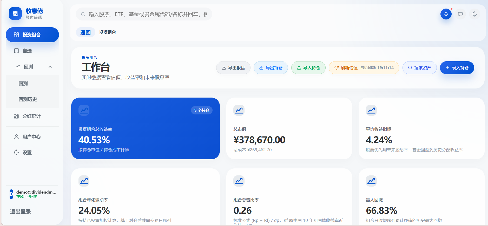 | 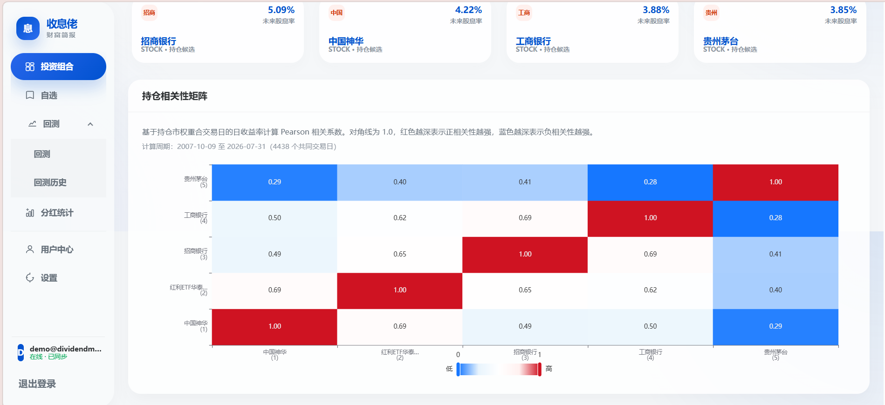 | 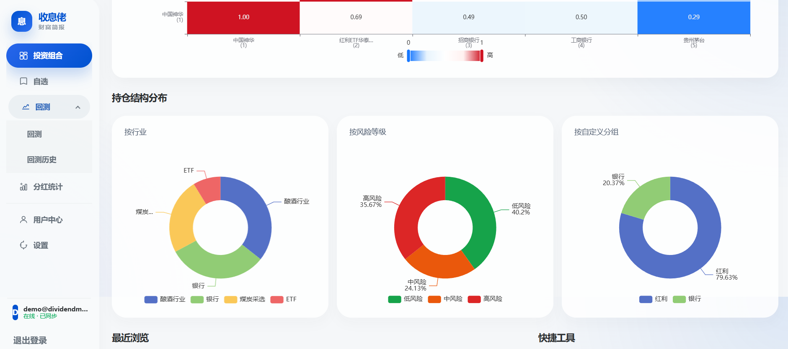 |

### Stock Detail

| Price & Valuation | History & Future Yield | Valuation Trend |
|:---:|:---:|:---:|
| 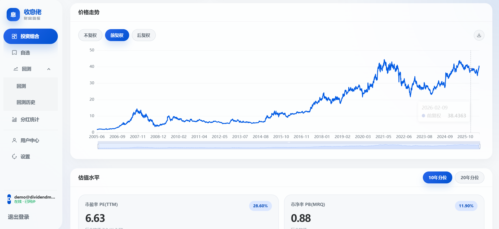 | 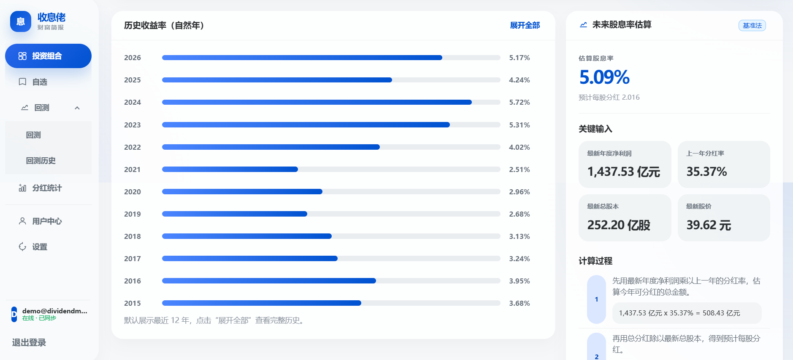 | 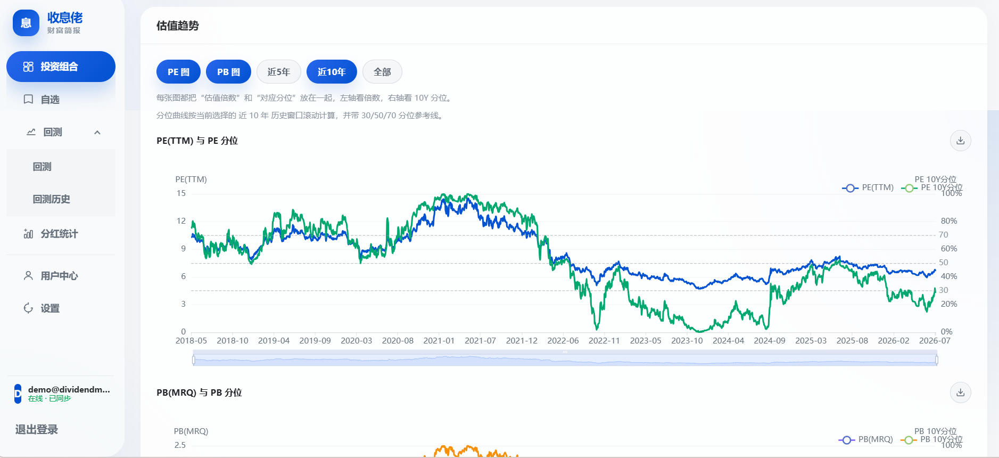 |

### Dividends & Backtest

| Dividend Estimation | Yearly & Monthly Dividends | Reinvestment Backtest |
|:---:|:---:|:---:|
| 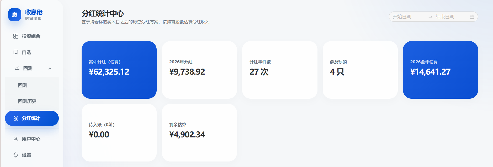 | 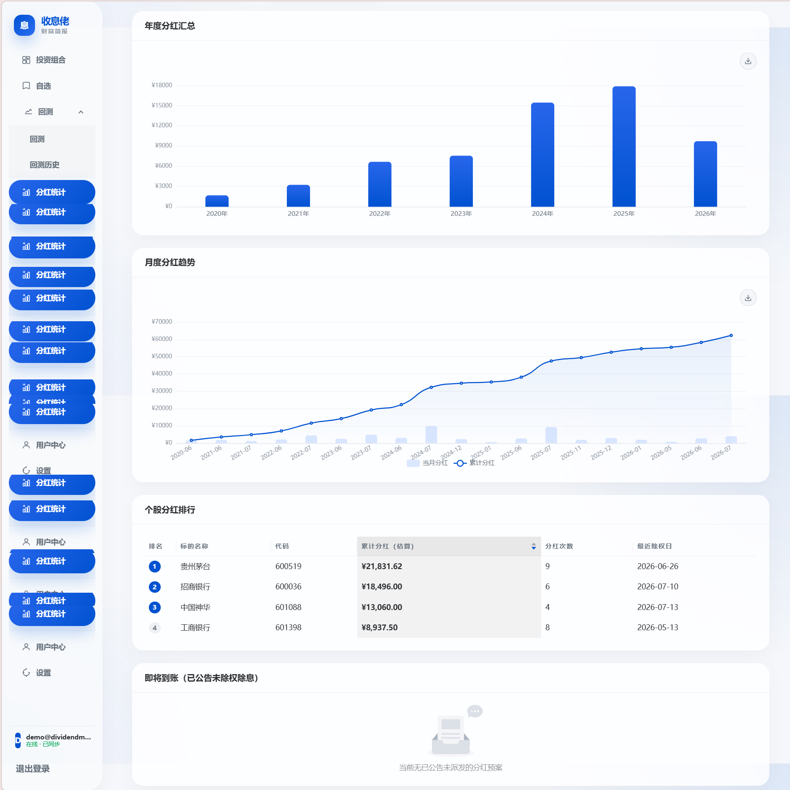 | 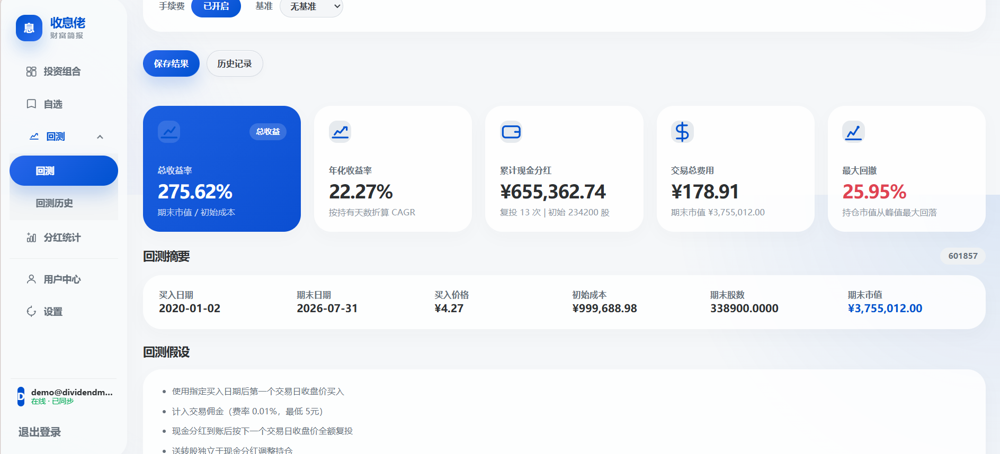 |

### Watchlist & Settings

| Watchlist | Asset Detail | Cloud Sync & Settings |
|:---:|:---:|:---:|
| 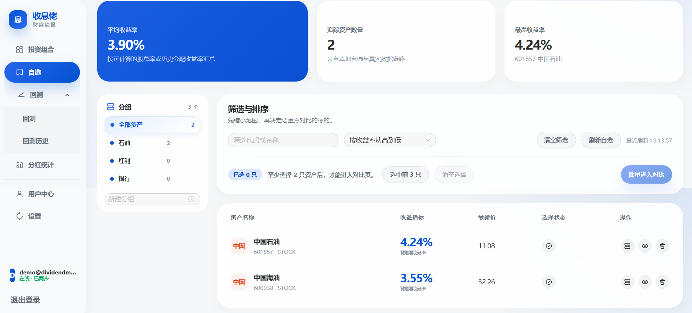 | 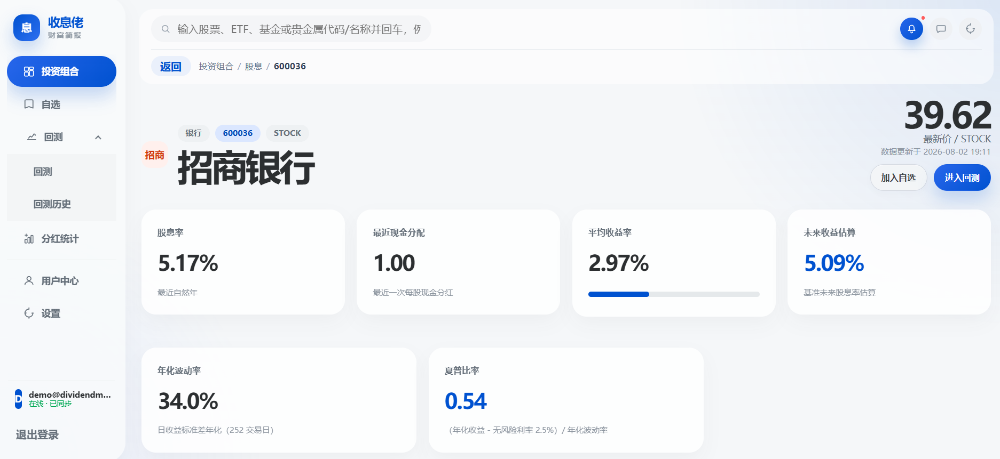 | 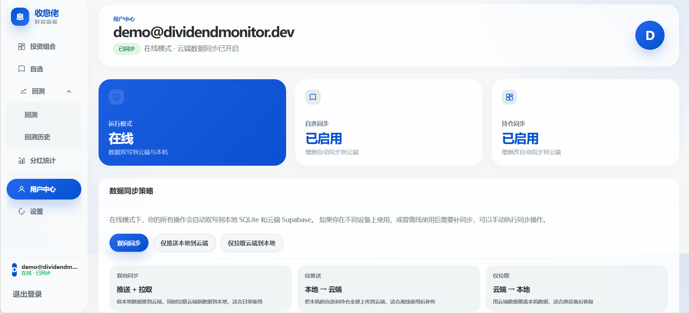 |

> Screenshots use a demo account with public market data; no personal portfolio information is shown.

## Features

- **Unified multi-asset search**: stocks / ETFs / funds / precious metals in one flow, with consistent yield metrics
- **Dividend & yield analysis**: full dividend event history, annual dividend yield, latest cash distribution, and estimated future yield (with a transparent calculation breakdown)
- **Valuation analysis**: PE(TTM) / PB(MRQ) with historical percentiles (10Y / 20Y windows), 30/50/70 percentile guides, industry comparison, and ROE
- **Portfolio management**: multiple buy/sell transactions per asset, automatic cost adjustment for corporate actions (factor-based), portfolio return / volatility / Sharpe ratio / max drawdown, and a correlation matrix
- **Watchlist groups**: organize assets into custom groups for quick comparison
- **Multi-asset comparison**: side-by-side yield, valuation, and dividend comparison
- **Dividend reinvestment backtest**: simulates reinvestment using real historical prices and dividend events, with return curves, cash-flow ledger, and annualized return
- **Dividend center**: estimated cumulative dividend income by holdings, yearly summaries, monthly trends, per-asset rankings, and upcoming payout alerts
- **Industry analysis**: portfolio industry distribution, average dividend yield / PE / ROE per industry, and constituent rankings
- **Chart export**: PNG images (with a composited title bar) and CSV data export
- **Local-first with optional cloud sync**: data lives in a local SQLite database; log in with Supabase for cloud backup and multi-device sync
- **Backup & restore**: one-click backup of local data files, with restore support (including cloud write-back in online mode)

## Getting Started

**Requirements**: Windows / macOS / Linux, Node.js ≥ 18

```bash
# Install dependencies
npm install

# Start the Electron desktop dev environment
npm run dev

# Browser preview mode (headless main process + frontend dev server)
npm run dev:browser-preview
# Open http://127.0.0.1:8192

# Type check
npm run typecheck

# Run tests (50+ tests in tests/)
npm test

# Build the Windows installer (NSIS)
npm run dist:win
```

## Online Mode (Optional)

By default the app runs offline and data stays on your machine. To enable multi-device sync:

1. Create a project at [Supabase](https://supabase.com)
2. Copy `.env.example` to `.env` and fill in `SUPABASE_URL` and `SUPABASE_ANON_KEY`
3. Sign up / sign in inside the app to switch to online mode; data syncs to the cloud automatically

## Tech Stack

| Area | Choice |
|------|--------|
| Desktop shell | Electron 35 + electron-vite 3 |
| Frontend | React 18 + TypeScript 5.8 (strict) + Ant Design 5 + ECharts 5 |
| Routing | React Router (HashRouter, `file://` compatible) |
| Storage | SQLite (built-in `node:sqlite`, no ORM, with migrations) |
| Cloud sync | Supabase (auth + cloud repositories) |
| Data sources | Eastmoney / Tencent / Sina free market APIs (unified gateway with rate limiting & circuit breaker) |
| Testing | Vitest |

## Architecture

```
UI (renderer) → Hook → renderer service → runtime selector
  → Electron bridge → IPC → UseCase → Repository → Adapter → Infra
  → browser fallback (mock / HTTP API)
```

- The main process follows a clean architecture: `domain` (pure business logic) → `application` (use cases) → `repositories` / `adapters` → `infrastructure`, with strict one-way dependency
- Core computations (backtest, valuation, corporate-action adjustments) live in the domain layer and are unit-testable in isolation
- The cross-process API contract is centralized in `shared/api.ts`, shared by both IPC and the local HTTP API
- Three interchangeable runtimes: Electron desktop, browser mock, and browser HTTP

See [docs/README.md](docs/README.md) for the full documentation index (architecture, multi-asset design, data-source gateway, IPC contracts, HTTP API, UI design principles).

## Documentation

| Doc | Description |
|-----|-------------|
| [docs/PRD.md](docs/PRD.md) | Product requirements |
| [docs/SDD.md](docs/SDD.md) | System design overview |
| [docs/ARCHITECTURE.md](docs/ARCHITECTURE.md) | Code layering & directory responsibilities |
| [docs/MULTI-ASSET-ARCHITECTURE.md](docs/MULTI-ASSET-ARCHITECTURE.md) | Multi-asset architecture |
| [docs/DATA-SOURCE-GATEWAY-ARCHITECTURE.md](docs/DATA-SOURCE-GATEWAY-ARCHITECTURE.md) | Data-source gateway architecture |
| [docs/ONLINE-ARCHITECTURE.md](docs/ONLINE-ARCHITECTURE.md) | Online mode (Supabase) architecture |
| [docs/IPC-CONTRACTS.md](docs/IPC-CONTRACTS.md) | IPC & runtime interfaces |
| [docs/HTTP-API.md](docs/HTTP-API.md) | Local HTTP API |
| [docs/PACKAGING-AND-DEPLOYMENT.md](docs/PACKAGING-AND-DEPLOYMENT.md) | Packaging & deployment |

## License

Licensed under the [GNU Affero General Public License v3.0](LICENSE):

- You may freely use, modify, and redistribute the project (including network-service scenarios)
- Redistributions and network services must keep the source code open and retain copyright/license notices
- See [TRADEMARKS.md](TRADEMARKS.md) for project name, logo, and branding usage

## Status

- Version: `0.3.0`
- Platform: Windows desktop first (electron-builder + NSIS), cross-platform buildable
- Asset scope: A-shares / ETFs / funds / precious metals
