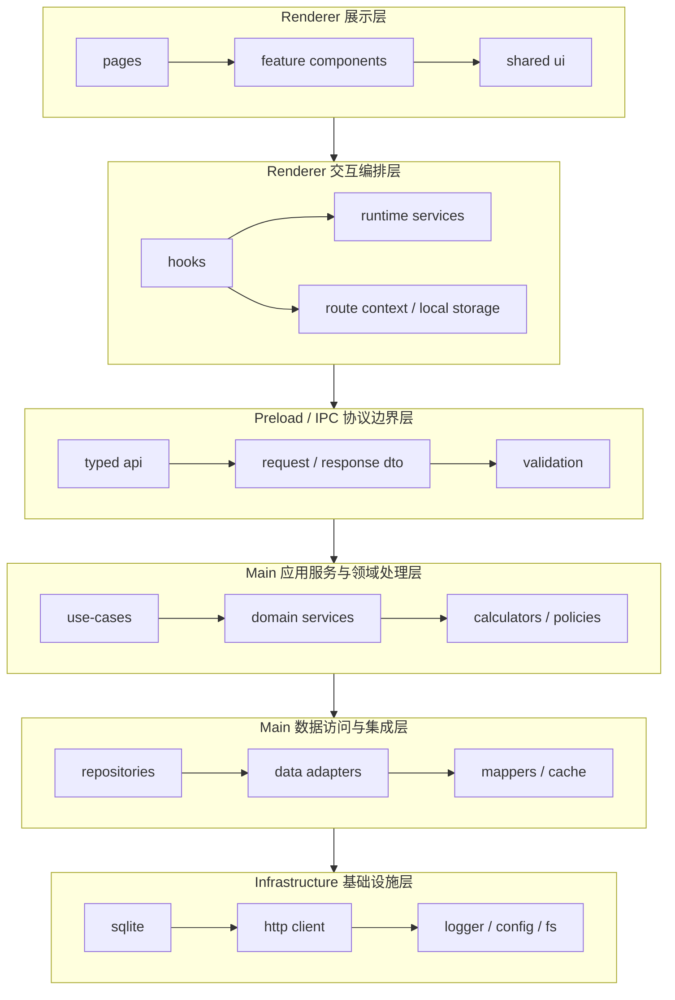
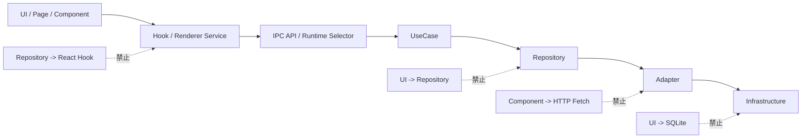
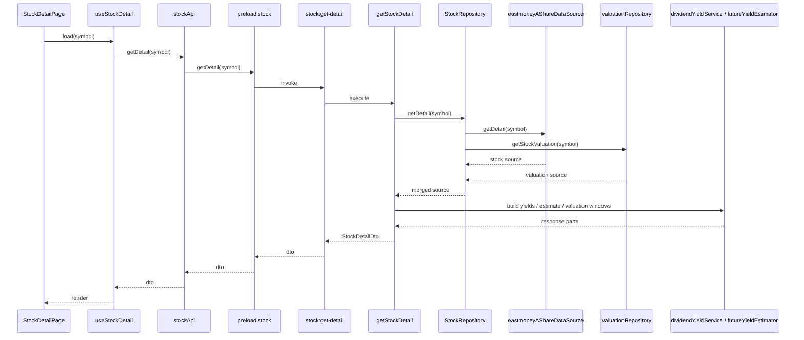
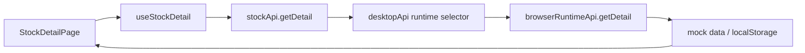

# DividendMonitor Architecture

## 1. 文档目标

本文档用于细化 DividendMonitor 的分层架构设计，重点解决以下问题：

1. 数据层、处理层、展示层如何彻底分开
2. Electron 主进程与 React 渲染进程分别承担什么职责
3. 每类组件、服务、模块应该如何抽象
4. 代码目录如何组织，才能支持后续持续扩展

本文档是 `SDD.md` 的补充设计，默认技术栈为 `Electron + React + Ant Design + TypeScript + SQLite`。

当前工程目录已经完成一轮“保留边界、减少跳转”的简化。本文档继续描述稳定的职责边界，不要求为了分层而保留过深目录。

## 2. 架构目标

### 2.1 目标

1. 让数据接入、计算逻辑、界面展示互相解耦
2. 让股息率计算、未来股息率估算、回测引擎可独立测试
3. 让页面层尽量薄，只负责状态编排和展示
4. 让组件边界清晰，避免业务逻辑散落在 UI 中
5. 让后续扩展 Web 端或更多资产类别时可以复用核心逻辑

### 2.2 非目标

1. 首期不追求微服务化
2. 首期不拆多仓库
3. 首期不做过度通用的低价值抽象

## 3. 总体分层

整体建议采用“纵向按运行时拆分，横向按职责分层”的方式。

```text
+----------------------------------------------------------------+
|                        Renderer 展示层                         |
| pages -> feature components -> shared ui                       |
+----------------------------------------------------------------+
|                      Renderer 交互编排层                       |
| hooks -> runtime services -> route context / local storage     |
+----------------------------------------------------------------+
|                    Preload / IPC 协议边界层                    |
| typed api -> request dto -> response dto -> validation         |
+----------------------------------------------------------------+
|                  Main 应用服务与领域处理层                     |
| use-cases -> domain services -> calculators -> policies        |
+----------------------------------------------------------------+
|                   Main 数据访问与集成层                        |
| repositories -> data adapters -> mappers -> cache             |
+----------------------------------------------------------------+
|                      Infrastructure 基础设施层                 |
| sqlite -> http client -> logger -> config -> fs               |
+----------------------------------------------------------------+
```

### 3.1 分层结构图



## 4. 依赖方向规则

必须遵守以下单向依赖规则：

1. 展示层只能依赖交互编排层，不能直接依赖数据库、HTTP 或计算细节
2. 交互编排层只能通过 preload API 调用主进程能力，不能直接触达 Node.js 能力
2.1 浏览器预览是例外场景：允许通过 renderer runtime adapter 回退到纯浏览器实现，但该实现不能泄漏 Node.js 能力
3. 主进程应用服务层可以依赖领域服务层和数据访问层
4. 数据访问层不能反向依赖页面、组件或 store
5. 共享 UI 组件不能依赖具体业务模块
6. 业务组件可以依赖共享组件，但共享组件不能依赖业务组件

简单说：

```text
UI -> Hook / Service -> IPC API -> UseCase -> Repository -> Adapter -> Infra
```

当前代码补充：

```text
UI -> Hook -> renderer service -> runtime selector
   -> Electron bridge -> IPC -> UseCase -> Repository -> Infra
   -> browser fallback adapter
```

### 4.1 依赖方向图



禁止出现：

```text
UI -> Repository
UI -> SQLite
Component -> HTTP Fetch
Shared UI -> WatchlistStore
Repository -> React Hook
```

## 5. 运行时职责拆分

### 5.1 Renderer 负责什么

- 页面路由
- 用户交互
- UI 状态
- 视图模型组装
- 表格、图表、表单展示
- 加载态、空态、错误态处理

### 5.2 Renderer 不负责什么

- 直接请求第三方 A 股接口
- 直接访问 SQLite
- 执行复杂股息率计算
- 执行回测主逻辑
- 处理股本变更归一化

### 5.3 Main 负责什么

- 外部数据源接入
- 本地缓存与数据库读写
- 统一字段映射
- 统一计算逻辑
- 回测执行
- IPC handler
- 应用配置和日志

## 6. 主进程分层设计

主进程建议再拆为 5 层。

### 6.1 Infrastructure 层

职责：

- 封装 SQLite
- 封装 HTTP Client
- 封装日志
- 封装配置读取
- 封装文件系统

建议目录：

```text
src/main/infrastructure/
  db/
    sqlite.ts
    migrations/
  http/
    httpClient.ts
  logging/
    logger.ts
  config/
    env.ts
  time/
    tradingCalendar.ts
```

当前实现说明：

1. `sqlite.ts` 目前使用 Node 内建 `node:sqlite`
2. 当前尚未引入第三方 SQLite npm 包，也尚未引入 ORM
3. 当前 schema 仅覆盖 `watchlist_items` 与 `app_settings`

### 6.2 Adapter 层

职责：

- 对接东方财富、新浪、巨潮等免费接口
- 把第三方字段转换为系统内部统一结构
- 隐藏外部接口的差异和脏数据

当前更推荐的目录：

```text
src/main/adapters/
  contracts.ts
  index.ts
  eastmoney/
    eastmoneyAShareDataSource.ts        # A 股搜索 + 行情 + 分红
    eastmoneyFundCatalogAdapter.ts      # 基金/ETF 搜索
    eastmoneyFundDetailDataSource.ts    # 基金/ETF 详情 + 分红 HTML 解析
    eastmoneyValuationAdapter.ts        # PE/PB 估值快照与趋势
    eastmoneyUtils.ts                   # 共享工具函数
```

说明：

1. 当前体量下，`contracts.ts` 统一承载 adapter 契约，减少碎文件
2. `eastmoneyAShareDataSource.ts` 负责股票搜索、行情、分红等基础接入
3. `eastmoneyFundDetailDataSource.ts` 负责基金/ETF 的详情 HTML 抓取、分红记录解析、K 线数据获取（`fqt=0` 未复权）
4. `eastmoneyFundCatalogAdapter.ts` 负责基金/ETF 的搜索与类型识别
5. `eastmoneyValuationAdapter.ts` 负责估值快照和趋势接入
6. 当后续出现第二个以上外部源或 adapter 数量明显增长时，再细分为 `quote/dividend/finance` 子适配器

规则：

1. adapter 只负责接入和映射，不承载业务决策
2. adapter 输出统一 DTO，不直接输出给前端页面

### 6.3 Repository 层

职责：

- 聚合缓存、本地库和远端接口
- 为上层提供统一数据访问能力
- 管理缓存策略、刷新策略和回源策略

当前目录：

```text
src/main/repositories/
  assetProviderRegistry.ts    # 资产提供者注册表 + AssetProvider 接口
  assetRepository.ts          # 资产仓储（按 assetKey 路由到对应 Provider）
  watchlistRepository.ts      # 自选管理
  valuationRepository.ts      # PE/PB 估值数据
```

`AssetProviderRegistry` 是核心路由层：根据 `AssetIdentifierDto` 的 `assetType` 分发到 `StockAssetProvider` / `EtfAssetProvider` / `FundAssetProvider`，每个 Provider 实现 `supports` / `search` / `getDetail` / `compare` / `getCapabilities` 方法。

典型模式：

1. 先查本地缓存
2. 判断是否过期
3. 需要时回源外部接口
4. 写回本地
5. 返回统一领域数据

当前实现补充：

1. `watchlistRepository.ts` 已落地，并已改为走 SQLite
2. `stockRepository.ts` 当前负责聚合基础股票数据与估值数据
3. `valuationRepository.ts` 已落地，负责估值链路的 source priority、15 分钟内存缓存与本地 percentile fallback
4. “缓存优先再回源”的完整仓库模式仍未全面落地，目前仅估值链路具备最小缓存策略

### 6.4 Domain 层

职责：

- 核心业务规则
- 计算公式
- 口径策略
- 回测策略
- 数据校验与归一化

建议目录：

```text
src/main/domain/
  entities/
    Stock.ts
    DividendEvent.ts
    FinancialSnapshot.ts
    BacktestPosition.ts
  services/
    dividendYieldService.ts
    futureYieldEstimator.ts
    dividendReinvestmentBacktestService.ts
  policies/
    dividendYearPolicy.ts
    reinvestmentPolicy.ts
    estimatePolicy.ts
  validators/
    inputValidator.ts
```

设计要求：

1. domain 层不关心 Electron、IPC、React
2. domain 层只处理业务对象和业务规则
3. 核心算法必须优先写在 domain 层，保证可单测

### 6.5 Application 层

职责：

- 组织用例
- 编排 repository 和 domain service
- 对外输出给 IPC handler

建议目录：

```text
src/main/application/
  useCases/
    searchStocks.ts
    getStockDetail.ts
    getHistoricalYield.ts
    estimateFutureYield.ts
    compareStocks.ts
    buildYieldMap.ts
    runDividendReinvestmentBacktest.ts
```

用例特征：

1. 一次用户动作对应一个 use case
2. use case 不直接关心 UI
3. use case 返回渲染层可消费的 response DTO

### 6.6 IPC Interface 层

职责：

- 注册 IPC channel
- 参数校验
- 调用 application use case
- 把错误转换成统一响应结构

建议目录：

```text
src/main/ipc/
  channels/
    stockChannels.ts
    watchlistChannels.ts
    calculationChannels.ts
    visualizationChannels.ts
  schemas/
    stockSchemas.ts
    calculationSchemas.ts
```

## 7. 渲染进程分层设计

渲染层建议采用“页面层 + 容器层 + 业务组件层 + 纯展示组件层”的结构。

### 7.1 页面层 Page

职责：

- 路由入口
- 页面布局
- 组合多个容器

特点：

- 尽量不写复杂业务逻辑
- 不直接发 IPC 请求
- 不直接写计算逻辑

建议目录：

```text
src/renderer/src/pages/
  DashboardPage.tsx
  StockSearchPage.tsx
  StockDetailPage.tsx
  ComparisonPage.tsx
  YieldMapPage.tsx
  BacktestPage.tsx
  SettingsPage.tsx
```

### 7.2 容器层 Container

职责：

- 调用 hooks / store
- 处理页面级状态
- 把数据转换为展示组件可消费的 props

示例：

- `StockDetailContainer`
- `ComparisonContainer`
- `BacktestContainer`

规则：

1. container 可以依赖业务 hooks
2. container 可以拼装多个业务组件
3. container 不直接写第三方接口请求

### 7.3 业务组件层 Feature Component

职责：

- 承载某个业务场景的可复用模块
- 内聚某一块业务展示和交互

示例：

- `DividendYieldChart`
- `DividendEventTable`
- `FutureYieldEstimateCard`
- `BacktestResultPanel`
- `WatchlistTable`
- `YieldMapTreemap`

规则：

1. feature component 可包含少量交互状态
2. feature component 不应直接依赖全局 store，优先通过 props 获取数据
3. feature component 不应自己做跨模块业务决策

### 7.4 纯展示组件层 Shared UI

职责：

- 通用样式和基础交互
- 与业务语义弱耦合

示例：

- `AppCard`
- `MetricValue`
- `SectionHeader`
- `LoadingBlock`
- `EmptyState`
- `ErrorState`
- `DateRangePicker`

规则：

1. shared ui 不依赖业务 store
2. shared ui 不感知股票、分红、回测等领域概念
3. shared ui 只通过 props 渲染

### 7.5 Hook 层

职责：

- 封装页面或业务的交互逻辑
- 管理异步请求、刷新、错误处理

建议目录：

```text
src/renderer/src/hooks/
  useStockSearch.ts
  useStockDetail.ts
  useHistoricalYield.ts
  useFutureYieldEstimate.ts
  useComparison.ts
  useBacktest.ts
```

规则：

1. hook 可以调 store 和 renderer service
2. hook 不应直接拼接第三方接口 URL
3. hook 不应包含难以复用的 DOM 细节

### 7.6 Renderer Service 层

职责：

- 封装对 preload API 或浏览器 fallback 的调用
- 管理 request/response DTO 转换
- 为 hooks 提供稳定调用接口

建议目录：

```text
src/renderer/src/services/
  desktopApi.ts
  browserRuntimeApi.ts
  stockApi.ts
  watchlistApi.ts
  calculationApi.ts
  routeContext.ts
```

规则：

1. renderer service 是渲染层访问运行时能力的唯一正式入口
2. hook 和 store 不直接调用 `window.electron.ipcRenderer`
3. Electron 桌面端走 preload bridge，浏览器预览走 browser fallback
4. service 负责把后端返回值整理成前端易消费结构

### 7.7 Store 层

职责：

- 管理全局共享状态
- 管理用户偏好和跨页状态

适合放入 store 的内容：

- 当前选中的股票
- 自选列表
- 设置项
- 最近查看记录

不适合放入 store 的内容：

- 单次表单临时态
- 明显只在单个组件内使用的状态
- 可以通过 query 即时获取的大对象原始数据

## 8. 组件抽象规范

### 8.1 组件分类

建议统一按四类命名：

1. `Page`：页面入口
2. `Container`：数据编排容器
3. `Panel/Card/Table/Chart`：业务展示组件
4. `Base/App`：基础共享组件

### 8.2 组件职责示例

#### StockDetailPage

- 负责页面布局和路由参数接入

#### StockDetailContainer

- 负责加载股票详情、自然年股息率、未来估算结果
- 负责把数据分发给不同业务组件

#### DividendYieldChart

- 只负责图表展示与交互事件抛出
- 不负责请求数据

#### FutureYieldEstimateCard

- 只负责展示估算方法、结果和公式展开区

#### MetricValue

- 只负责格式化后的数值展示

### 8.3 Props 设计原则

1. 尽量传递已经准备好的展示数据
2. 少让子组件知道过多原始领域字段
3. 回调函数语义要明确，如 `onYearChange`、`onCompareClick`
4. 避免把整页 store 实例直接透传给组件

## 9. 建议目录结构

以下目录结构是当前阶段更推荐的“简化后结构”，目标是在保留边界的同时降低跳转成本。

```text
src/
  main/
    adapters/
      contracts.ts
      eastmoney/
    application/
      useCases/
    domain/
      services/
      entities/
    repositories/
    infrastructure/
    ipc/
  preload/
    index.ts
  renderer/
    src/
      layouts/
      router/
      pages/
      components/
        app/
        stock-detail/
        comparison/
        watchlist/
        backtest/
      hooks/
      services/
      styles/
shared/
  contracts/
```

## 10. 当前阶段的简化规则

针对首期工程，补充以下简化约束：

1. 页面如果只是“拿数据再透传给一个容器”，则优先删除 `Container`
2. 业务组件允许直接放在 `components/<feature>/`，不强制保留 `features/*/components`
3. 只有当某个业务模块同时出现组件、局部 hook、mapper、types 时，才重新升格回 `features/<module>/`
4. `services/api` 这一层级对当前工程偏重，优先收拢为 `services/`
5. `app/layouts`、`app/router` 这种单一子目录优先拆平

这样做的目的不是否定分层，而是把“分层”保留在职责上，而不是堆到路径深度上。

## 11. 前端模块组织建议

当前前端以“页面 + 业务组件 + hook + runtime service”的轻量组织为主，不再强制引入 `features/` 目录。

推荐结构：

```text
src/renderer/src/
  pages/
    StockDetailPage.tsx
  components/
    stock-detail/
      FutureYieldEstimateCard.tsx
      YearlyDividendTrendChart.tsx
  hooks/
    useStockDetail.ts
  services/
    stockApi.ts
    routeContext.ts
```

这样做的好处：

1. 当前体量下更容易定位入口
2. 页面、组件、数据访问职责仍然清晰
3. 避免为了抽象而引入低价值目录层级

补充约束：

1. 只有当某个业务同时出现组件、局部 hook、mapper、types 且文件数明显增长时，才重新升格为 `features/<module>/`
2. 共享布局、通用卡片和状态组件继续留在 `components/app/`
3. 路由上下文、runtime selector、API 访问保持在 `services/`，不要回流到页面组件

## 12. DTO 与 ViewModel 规范

### 11.1 DTO

DTO 用于跨进程、跨层传输，强调字段完整和结构稳定。

例如：

```ts
type HistoricalYieldResponseDto = {
  symbol: string;
  yearlyYields: Array<{
    year: number;
    yield: number;
    events: number;
  }>;
  basis: string;
};
```

### 11.2 ViewModel

ViewModel 用于前端展示，强调可直接渲染。

例如：

```ts
type HistoricalYieldChartViewModel = {
  title: string;
  xAxisLabels: string[];
  series: number[];
  tooltipItems: string[];
  basisLabel: string;
};
```

规则：

1. repository 返回领域对象
2. use case 返回 DTO
3. renderer service / mapper 生成 ViewModel
4. component 接收 ViewModel 或更轻量 props

## 13. 一个完整调用链示例

以“打开股票详情页”场景为例：

```text
StockDetailPage
  -> useStockDetail()
    -> stockApi.getDetail(symbol)
      -> preload.stock.getDetail(symbol)
        -> ipc: stock:get-detail
          -> getStockDetail use case
            -> stockRepository
              -> eastmoneyAShareDataSource
              -> valuationRepository
                -> eastmoneyValuationAdapter
            -> dividendYieldService
            -> futureYieldEstimator
            -> buildValuationWindows
          -> response DTO
  -> render page / stock-detail components
```

### 13.1 股票详情调用链图



这个链路里：

1. 页面不直接调数据库
2. 图表组件不关心数据来自哪里
3. 计算逻辑不会散落到 React 组件中

浏览器预览场景下，该链路当前退化为：

```text
StockDetailPage
  -> useStockDetail()
    -> stockApi.getDetail(symbol)
      -> desktopApi runtime selector
        -> browserRuntimeApi.getDetail(symbol)
      -> response DTO
  -> render page
```

### 13.2 浏览器预览调用链图



## 14. 回测模块的特别约束

回测模块是首期最容易失控的部分，必须额外约束：

1. 回测公式和持仓演进只能放在 main/domain
2. 前端只能展示结果和过程，不做核心收益计算
3. 回测过程必须可重放，输入条件一致时结果必须一致
4. 所有回测假设必须在 UI 中可见

## 15. 命名与边界建议

### 14.1 命名建议

- 领域规则用 `Service` 或 `Policy`
- 用户动作用 `UseCase`
- 第三方接入用 `Adapter`
- 数据读写汇总用 `Repository`
- 页面拼装用 `Container`
- 通用展示用 `Base` 或 `App`

### 14.2 边界建议

- 一个文件只承担一类职责
- 一个组件尽量只服务一个业务意图
- 一个 use case 尽量只响应一个用户动作
- 一个 repository 不要同时承载太多不同领域数据

## 16. 首期落地顺序建议

1. 先搭 `shared contracts`、`main domain`、`renderer service` 的边界
2. 再做 `stock-detail` 这一条主链路，验证分层设计
3. 然后复用同样模式扩展到 `watchlist`、`comparison`、`backtest`
4. 最后再补齐地图、设置和缓存优化

## 17. 建议的下一步产出

基于本文档，建议马上继续补以下内容：

1. `docs/DATA-SOURCE-DESIGN.md`
2. `docs/IPC-CONTRACTS.md`
3. `docs/DB-DDL.sql`
4. `src` 目录脚手架初始化

## 18. 当前实现状态（2026-04-27）

1. Main 侧已落地最小数据库设施与 `watchlistRepository`
2. Main 侧已落地多资产路由：`AssetProviderRegistry` + Stock / ETF / Fund 三个 Provider
3. Renderer 侧已落地 `desktopApi` 运行时选择器与 `browserRuntimeApi`
4. 架构目标中的”统一 renderer service 接口、多运行时实现”已开始落地
5. 前端能力驱动渲染：`StockDetailPage` 通过 `data.capabilities` 控制模块显隐
6. ETF/基金完整链路已通：搜索 → 详情 → 历史分配收益率 → 未来分配率估算
7. `FutureYieldEstimateCard` 区分股票（财务驱动）和基金（分配记录驱动）的估算展示
8. 架构目标中的”完整缓存层、完整 repository 回源策略、显式 SQLite 第三方依赖”尚未完成
