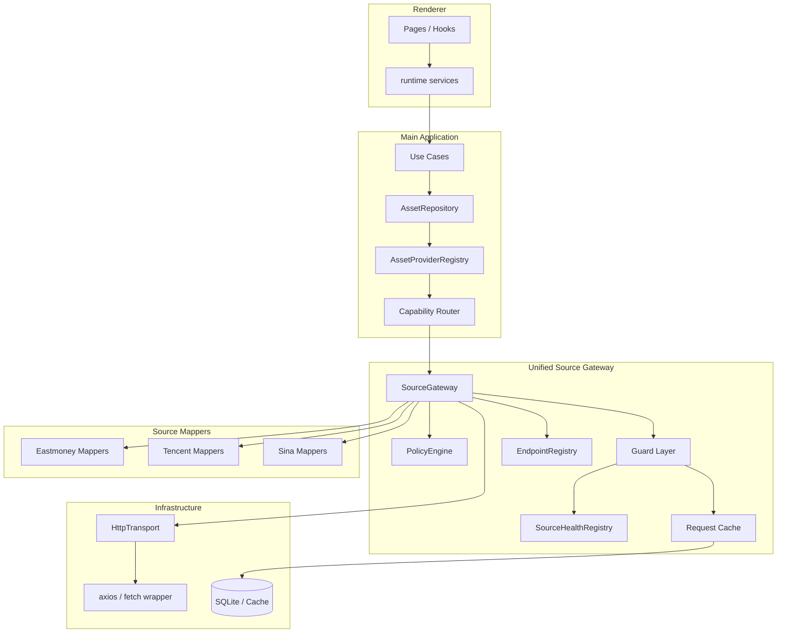

# 统一数据源网关架构设计

## 1. 文档目标

本文档用于为 DividendMonitor 设计一套统一的外部数据接入架构，解决当前多数据源场景下：

1. 第三方 API 与 URL 分散在各处
2. 请求头、超时、Referer、错误处理不一致
3. 源选择、降级、保护逻辑散落在 adapter 和 use case 中
4. 新增数据源或替换上游时改动面过大
5. 同类能力在股票、ETF、基金之间重复实现

本文档关注以下问题：

1. 如何统一存放 API、URL、请求策略与解析入口
2. 如何在保留现有分层前提下引入统一网关
3. 如何把数据源选择从业务类中剥离出来
4. 如何统一实现 fallback、熔断、限流、缓存和错误模型
5. 如何分阶段落地，避免一次性推翻现有实现

本文档是架构设计文档，不要求一次性完成全部实现，但要求后续实现方向、模块边界和接口形式保持稳定。

## 2. 背景与问题

### 2.1 当前项目特点

当前项目已经具备比较清晰的主干分层：

```text
UI -> Hook / Renderer Service -> IPC / HTTP API -> UseCase -> Repository -> Adapter -> Infra
```

现有代码在以下方面已经具备良好基础：

1. `AssetRepository` 与 `AssetProviderRegistry` 已经承担了多资产的业务路由职责
2. `renderer` 侧已经通过 runtime service 隔离了 Electron bridge 与 browser fallback
3. `main` 侧已经把数据库、Supabase、HTTP 等能力放入 `infrastructure`
4. 股票、ETF、基金已经形成初步的 provider / repository / adapter 骨架

因此，本次设计不是推翻已有架构，而是在现有骨架中补齐“统一外部数据接入层”。

### 2.2 当前主要问题

结合现有代码，当前问题主要集中在以下几个方面。

#### 2.2.1 URL 与上游信息分散

当前多个外部源的 URL、token、Referer 和查询参数直接写在具体实现中，例如：

1. Eastmoney 股票搜索 URL 直接写在 `eastmoneyAShareDataSource.ts`
2. Eastmoney 基金搜索 URL 直接写在 `eastmoneyFundCatalogAdapter.ts`
3. 腾讯 ETF K 线 URL 直接写在 `eastmoneyFundDetailDataSource.ts`
4. 回测 benchmark K 线请求直接写在 `runDividendReinvestmentBacktestForAsset.ts`

这会导致：

1. 同一个上游接口被多个类重复拼接
2. token、header、path 变更时需要跨文件修改
3. 很难一眼看出系统到底依赖了哪些外部接口

#### 2.2.2 请求策略不一致

当前主进程 HTTP 层只提供了基础 `getJson()` / `getText()`，统一了部分超时和 Eastmoney push 接口 Referer，但仍存在：

1. 某些请求走统一 HTTP 客户端
2. 某些请求直接使用 `fetch`
3. 某些 adapter 内部自行 `try/catch`
4. 某些场景直接吞错后返回空结果

结果是：

1. 失败重试策略不统一
2. 错误分类不统一
3. fallback 逻辑无法复用
4. 很难做统一监控和统计

#### 2.2.3 源选择逻辑侵入业务类

目前“应该请求哪个上游”的判断分散在 adapter 或 use case 中，例如：

1. 股票详情内部决定从 Eastmoney 拉分红、从腾讯拉快照、从 Sina 补 K 线
2. ETF 详情内部决定从 Eastmoney HTML 拉基础信息、从腾讯拉 K 线、失败再从 Sina 补
3. 回测 benchmark 由 use case 直接决定访问腾讯 K 线

这会让业务类同时承担：

1. 业务组装
2. 上游路由
3. 降级决策
4. 异常恢复

导致类职责变重，测试复杂，行为不透明。

#### 2.2.4 缺少统一的保护机制

当前虽然有快照缓存和部分容错，但缺少统一的：

1. 限流
2. 并发控制
3. 熔断
4. 失败降级
5. 过期缓存兜底
6. 健康状态记录

这意味着：

1. 某个上游短时故障时，会被多处重复打满
2. 相同请求可能被并发重复发送
3. UI 只能拿到简单错误字符串，无法区分“临时故障”和“能力不可用”

### 2.3 根因总结

当前系统的问题不是“没有分层”，而是：

```text
外部数据接入规范尚未收口
```

更具体地说，是以下四个维度没有统一：

1. API / URL 存放位置
2. 请求发送入口
3. 源选择与降级策略
4. 故障保护与可观测性

## 3. 设计目标

### 3.1 核心目标

本次设计希望实现以下目标：

1. 所有第三方 API 定义统一收敛
2. 所有外部请求统一通过同一个网关入口发出
3. 所有源选择、fallback、熔断与缓存逻辑可配置、可复用
4. 业务类只表达“我要什么能力”，不表达“我该访问哪个 URL”
5. 新增或替换上游时，改动尽量收敛到 endpoint、mapper 和策略层

### 3.2 非目标

本次设计明确不追求以下事情：

1. 不把项目拆成微服务
2. 不为了“通用化”而引入过度复杂的插件系统
3. 不要求在第一阶段就支持运行时动态热插拔 provider
4. 不要求把所有数据源一次性全部重构完成
5. 不要求立即消除全部 stock 兼容接口

### 3.3 设计原则

1. **保留现有骨架**：继续沿用 `UseCase -> Repository -> Provider -> Adapter -> Infra`
2. **能力优先**：先描述需要什么能力，再决定走哪个上游
3. **策略外置**：fallback、超时、熔断、缓存不写死在业务类中
4. **入口唯一**：所有对外部源的请求必须走统一网关
5. **渐进迁移**：允许新旧实现并存，逐步切换
6. **可观测优先**：设计时同步考虑日志、错误分类和健康状态

## 4. 目标架构总览

### 4.1 总体思路

建议在当前 `Adapter` 与 `Infrastructure HTTP` 之间新增一层统一的数据源网关。

目标依赖链如下：

```text
UseCase
  -> Repository
    -> Provider
      -> Capability Router
        -> Source Gateway
          -> Endpoint Registry
          -> Policy Engine
          -> Guard Layer
          -> Transport
```

其核心思想是：

1. `Repository / Provider` 只描述业务能力和结果组装
2. `Source Gateway` 负责统一请求调度
3. `Endpoint Registry` 统一存放 URL、header、parser 定义
4. `Policy Engine` 统一决定主源、备用源、降级模式
5. `Guard Layer` 统一做限流、熔断、缓存和并发控制

### 4.2 总体架构图



### 4.3 各层职责

#### UseCase

负责：

1. 接收页面请求
2. 组织业务流程
3. 调用 repository 获取业务所需能力

不负责：

1. URL 选择
2. 上游 fallback
3. 限流与熔断

#### Repository / Provider

负责：

1. 根据资产类型与能力组织数据获取流程
2. 聚合不同能力结果为统一领域对象
3. 向 use case 暴露稳定接口

不负责：

1. 拼 URL
2. 写请求头
3. 管理第三方源健康状态

#### Capability Router

负责：

1. 将“业务能力”映射为“候选数据源链”
2. 结合资产类型、市场、运行模式做源路由
3. 为网关生成请求策略

#### Source Gateway

负责：

1. 接收统一请求描述
2. 调用 registry 找 endpoint
3. 应用 policy 和保护器
4. 执行请求、解析响应、执行 fallback
5. 返回标准化结果与元信息

#### Endpoint Registry

负责：

1. 统一管理 provider、endpoint ID、URL 模板、默认 headers、parser
2. 成为“项目依赖了哪些第三方接口”的单一信息源

#### Guard Layer

负责：

1. 限流
2. 并发控制
3. 熔断
4. 缓存
5. 过期缓存兜底
6. 健康统计

#### Source Mapper

负责：

1. 第三方原始数据解析
2. 第三方字段向领域对象映射

不负责：

1. 决定是否降级
2. 决定是否重试
3. 决定是否使用备用源

## 5. 核心设计概念

### 5.1 Provider 与 Capability

建议明确区分“数据源提供方”和“业务能力”。

#### Provider

表示第三方来源或内部来源，例如：

1. `eastmoney`
2. `tencent`
3. `sina`
4. `local-http`
5. 未来可扩展为 `self-hosted-proxy`

#### Capability

表示系统想获取的数据能力，而不是具体 URL，例如：

1. `asset.search`
2. `asset.profile`
3. `asset.quote`
4. `asset.dividend`
5. `asset.kline`
6. `valuation.snapshot`
7. `valuation.trend`
8. `benchmark.kline`

这样设计的好处是：

1. 业务层只关心需要什么数据
2. 数据源层可以灵活替换
3. 同一种能力可以有多个 provider

### 5.2 Endpoint

`Endpoint` 是某个 provider 下的具体接口定义，例如：

1. `eastmoney.search.suggest`
2. `eastmoney.push2.quote`
3. `eastmoney.push2his.kline`
4. `tencent.quote.snapshot`
5. `tencent.kline.index`
6. `sina.kline.daily`

一个 endpoint 需要固定描述：

1. 唯一 ID
2. provider
3. capability
4. method
5. URL 构造器
6. 默认请求头
7. timeout
8. parser 类型
9. mapper 标识

### 5.3 Source Request

统一网关的输入应是“标准化请求描述”，而不是已经拼好的 URL。

```ts
type SourceRequest<TInput> = {
  capability: Capability
  input: TInput
  providerHint?: ProviderKey
  fallbackProviders?: ProviderKey[]
  degradeMode?: DegradeMode
  cacheKey?: string
  cacheTtlMs?: number
  staleTtlMs?: number
  tags?: string[]
}
```

### 5.4 Source Response

统一网关的输出不仅包含数据，还应包含来源信息和降级状态。

```ts
type SourceResponse<TData> = {
  data: TData
  provider: ProviderKey
  endpointId: string
  isFallback: boolean
  isStale: boolean
  fetchedAt: string
}
```

### 5.5 Partial Result

对于资产详情这类复合请求，不要求所有子能力全部成功后才返回。

建议引入“部分成功”模型：

```ts
type PartialCapabilityResult<T> = {
  ok: boolean
  data?: T
  error?: SourceError
  isFallback?: boolean
  isStale?: boolean
}
```

例如：

1. 基础资料成功
2. 行情成功
3. K 线使用了备用源
4. 估值失败但整体详情仍可展示

这种场景应允许返回 `partial` 而不是整体报错。

## 6. 模块设计

### 6.1 建议目录结构

建议新增以下目录，并保留现有 repository / use case 骨架：

```text
src/main/
  infrastructure/
    data-sources/
      registry/
        endpointRegistry.ts
        eastmoneyEndpoints.ts
        tencentEndpoints.ts
        sinaEndpoints.ts
      gateway/
        sourceGateway.ts
        capabilityRouter.ts
        policyEngine.ts
        sourceHealthRegistry.ts
      guards/
        rateLimiter.ts
        circuitBreaker.ts
        concurrencyLimiter.ts
        requestCache.ts
      transport/
        httpTransport.ts
      types/
        sourceTypes.ts
        sourceErrors.ts
  adapters/
    mappers/
      eastmoney/
      tencent/
      sina/
```

### 6.2 Endpoint Registry

Registry 应成为所有第三方 endpoint 的统一入口。

接口示意：

```ts
type ProviderKey = 'eastmoney' | 'tencent' | 'sina'

type Capability =
  | 'asset.search'
  | 'asset.profile'
  | 'asset.quote'
  | 'asset.dividend'
  | 'asset.kline'
  | 'valuation.snapshot'
  | 'valuation.trend'
  | 'benchmark.kline'

type EndpointDefinition<TInput = unknown> = {
  id: string
  provider: ProviderKey
  capability: Capability
  method: 'GET'
  parser: 'json' | 'text'
  timeoutMs: number
  buildUrl: (input: TInput) => string
  headers?: Record<string, string>
  mapperId: string
}
```

设计初衷：

1. 让 URL 定义集中可查
2. 让 provider 改造时能快速定位全部外部接口
3. 让统一网关可根据 endpoint 元信息自动应用通用策略

### 6.3 Capability Router

Router 用于定义“每种能力的主源和备用源链”。

接口示意：

```ts
type RoutePlan = {
  primary: ProviderKey
  fallbacks: ProviderKey[]
  degradeMode: DegradeMode
}

interface CapabilityRouter {
  resolve(
    capability: Capability,
    context: {
      assetType?: 'STOCK' | 'ETF' | 'FUND'
      market?: 'A_SHARE'
      code?: string
    }
  ): RoutePlan
}
```

设计初衷：

1. 把数据源选择从 adapter 中剥离
2. 让股票、ETF、基金对同一能力走不同路由时可集中维护
3. 让未来通过配置切换 provider 成为可能

### 6.4 Policy Engine

Policy Engine 负责把业务请求转成可执行策略。

```ts
type DegradeMode = 'strict' | 'fallback' | 'stale-while-error'

type RequestPolicy = {
  timeoutMs?: number
  retryCount: number
  degradeMode: DegradeMode
  useCircuitBreaker: boolean
  useRateLimit: boolean
  useInFlightDedupe: boolean
  cacheTtlMs?: number
  staleTtlMs?: number
}
```

建议按 capability 预设策略：

1. `asset.search`: `fallback`
2. `asset.quote`: `fallback`
3. `asset.kline`: `stale-while-error`
4. `valuation.snapshot`: `fallback`
5. `benchmark.kline`: `fallback`
6. `auth.*`: `strict`

设计初衷：

1. 让重试、缓存、降级规则集中
2. 避免每个 adapter 自己写一套 `try/catch`
3. 让运维和调优可以只改策略层

### 6.5 Source Gateway

这是整个设计的核心。

接口示意：

```ts
interface SourceGateway {
  request<TInput, TOutput>(request: SourceRequest<TInput>): Promise<SourceResponse<TOutput>>
}
```

核心流程：

1. 读取 capability 和输入
2. 向 router 获取主源和备用源链
3. 根据 provider + capability 选择 endpoint
4. 应用策略与保护器
5. 发送请求并解析响应
6. 若失败，根据 degradeMode 执行 fallback
7. 若主源和备用源都失败且存在 stale cache，按策略返回过期缓存
8. 返回标准化结果

设计初衷：

1. 保证所有外部请求有统一入口
2. 让 fallback 和保护逻辑天然可复用
3. 让日志与错误模型统一

### 6.6 Guard Layer

Guard Layer 建议至少包含以下四类能力。

#### RateLimiter

职责：

1. 按 provider 限制单位时间请求数
2. 避免高频请求触发上游封锁

#### CircuitBreaker

职责：

1. 连续失败达到阈值后暂时打开熔断
2. 熔断期间跳过主源，优先走备用源
3. 冷却期后允许半开探测

#### ConcurrencyLimiter

职责：

1. 控制同类能力最大并发数
2. 避免某些聚合请求短时间打爆 socket

#### RequestCache

职责：

1. 短期缓存热点请求
2. 去重正在进行中的重复请求
3. 在主源故障时返回最近一次成功结果

### 6.7 Source Health Registry

建议维护每个 provider 的运行状态：

```ts
type SourceHealthSnapshot = {
  provider: ProviderKey
  recentSuccessCount: number
  recentFailureCount: number
  circuitState: 'closed' | 'open' | 'half-open'
  lastErrorAt?: string
  lastSuccessAt?: string
}
```

设计初衷：

1. 帮助降级决策
2. 帮助日志排查
3. 为后续“诊断页”或“开发态调试输出”打基础

## 7. 接口设计

### 7.1 统一类型定义

```ts
export type ProviderKey = 'eastmoney' | 'tencent' | 'sina'

export type Capability =
  | 'asset.search'
  | 'asset.profile'
  | 'asset.quote'
  | 'asset.dividend'
  | 'asset.kline'
  | 'valuation.snapshot'
  | 'valuation.trend'
  | 'benchmark.kline'

export type DegradeMode = 'strict' | 'fallback' | 'stale-while-error'

export type SourceRequest<TInput> = {
  capability: Capability
  input: TInput
  providerHint?: ProviderKey
  fallbackProviders?: ProviderKey[]
  degradeMode?: DegradeMode
  cacheKey?: string
  cacheTtlMs?: number
  staleTtlMs?: number
  tags?: string[]
}

export type SourceResponse<TData> = {
  data: TData
  provider: ProviderKey
  endpointId: string
  isFallback: boolean
  isStale: boolean
  fetchedAt: string
}
```

### 7.2 错误模型

建议统一错误类型，替代当前“直接抛字符串错误”的方式。

```ts
export type SourceErrorCode =
  | 'NETWORK'
  | 'TIMEOUT'
  | 'RATE_LIMITED'
  | 'UPSTREAM_4XX'
  | 'UPSTREAM_5XX'
  | 'PARSE_FAILED'
  | 'CIRCUIT_OPEN'
  | 'NO_FALLBACK_AVAILABLE'

export class SourceError extends Error {
  constructor(
    message: string,
    public readonly code: SourceErrorCode,
    public readonly provider: ProviderKey,
    public readonly endpointId: string,
    public readonly retryable: boolean
  ) {
    super(message)
  }
}
```

设计初衷：

1. 让日志能准确反映错误性质
2. 让 UI 或 use case 能区分“可重试错误”和“永久错误”
3. 让 fallback 条件更明确

### 7.3 Provider 配置

建议把现有简单的 `dataSourceMode` 扩展为更细粒度的 provider 配置。

```ts
type ProviderConfig = {
  enabled: boolean
  timeoutMs: number
  retryCount: number
  rateLimitPerSecond: number
  maxConcurrency: number
  circuitBreakerThreshold: number
  circuitBreakerCooldownMs: number
}

type AppConfig = {
  providers: {
    eastmoney: ProviderConfig
    tencent: ProviderConfig
    sina: ProviderConfig
  }
  routing: {
    'asset.search': ProviderKey[]
    'asset.profile': ProviderKey[]
    'asset.quote': ProviderKey[]
    'asset.dividend': ProviderKey[]
    'asset.kline': ProviderKey[]
    'valuation.snapshot': ProviderKey[]
    'valuation.trend': ProviderKey[]
    'benchmark.kline': ProviderKey[]
  }
}
```

设计初衷：

1. 让源切换从“改代码”变为“改配置”
2. 为后续新增 provider 留出配置空间
3. 为实验性 provider 提供灰度启用能力

## 8. 关键流程设计

### 8.1 资产详情请求流程

以“获取某个 ETF 详情”为例：

```text
UI 请求资产详情
  -> UseCase 调用 AssetRepository.getDetail()
  -> ETF Provider 声明需要 profile / quote / kline / dividend 四种能力
  -> Capability Router 为每种能力生成主源与备用源链
  -> Source Gateway 分别执行：
       profile 走 eastmoney html
       quote 走 eastmoney push2
       kline 先走 tencent，失败走 sina
       dividend 走 eastmoney fund html parser
  -> Provider 聚合结果为统一 FundAssetDetailSource
  -> 若估值缺失，则以 partial 形式返回，不阻断详情页
```

### 8.2 回测 benchmark 流程

当前 benchmark 价格直接在 use case 中 `fetch`，建议改为：

```text
UseCase 请求 benchmark.kline 能力
  -> Source Gateway
  -> Capability Router
  -> 先走 tencent.kline.index
  -> 若失败且策略允许，返回空 benchmark 或 stale 数据
```

这样 use case 不再依赖任何第三方 URL，也不需要关心腾讯接口格式。

### 8.3 搜索流程

搜索类能力与详情类能力不同，要求高可用但不允许过脏结果。

建议：

1. `asset.search` 主源可配置为 Eastmoney
2. 若主源失败，允许切备用源
3. 若无稳定备用源，则返回空数组并保留错误元信息
4. 不建议对搜索结果使用长期 stale cache，以免结果误导

## 9. 降级与保护策略

### 9.1 能力级降级建议

不同能力对降级的容忍度不同，建议如下：

| 能力 | 主策略 | 失败后的建议行为 |
|------|--------|------------------|
| `asset.search` | fallback | 无可用备用源时返回空结果和错误元信息 |
| `asset.profile` | fallback | 可缺字段，但不应伪造信息 |
| `asset.quote` | fallback | 可切备用行情源 |
| `asset.dividend` | fallback | 可返回空事件列表并标记 partial |
| `asset.kline` | stale-while-error | 可切备用源，仍失败时尝试 stale cache |
| `valuation.snapshot` | fallback | 缺失估值卡片，不阻断主流程 |
| `valuation.trend` | fallback | 图表缺失，不阻断详情页 |
| `benchmark.kline` | fallback | benchmark 缺失不阻断主回测 |

### 9.2 Stale 数据策略

建议只对以下能力允许返回 stale 数据：

1. `asset.quote`
2. `asset.kline`
3. `valuation.snapshot`
4. `benchmark.kline`

不建议对以下能力默认使用 stale：

1. `asset.search`
2. `auth.*`
3. 需要强一致写入的数据

### 9.3 部分成功策略

对于复合详情页，建议允许以下场景部分成功：

1. 基础信息成功，但估值失败
2. 分红成功，但 K 线走了备用源
3. 基础资料和价格成功，但行业字段缺失

不建议部分成功的场景：

1. 资产身份无法确认
2. 核心行情完全不可用且没有缓存兜底
3. 结果会导致明显误导

## 10. 与当前代码的映射关系

### 10.1 当前保留不动的部分

以下层次可以保留：

1. `UseCase`
2. `AssetRepository`
3. `AssetProviderRegistry`
4. 渲染层 `assetApi` / `desktopApi` / `browserRuntimeApi`
5. 现有 SQLite / Supabase 仓库结构

### 10.2 需要重构的部分

#### 第一类：抽出 endpoint 定义

目标：

1. 把 Eastmoney 搜索 URL、Push2、Push2His、DataCenter 等定义从 adapter 中抽出
2. 把 Tencent K 线和 quote URL 抽出
3. 把 Sina K 线 URL 抽出

#### 第二类：统一触网入口

目标：

1. 所有外部请求走 `SourceGateway`
2. 禁止 use case 直接 `fetch`
3. 禁止业务类直接拼装第三方 URL

#### 第三类：adapter 变薄

目标：

1. adapter 主要保留 mapper 职责
2. provider 主要保留能力声明和业务聚合职责
3. fallback 和保护逻辑移出 adapter

### 10.3 当前文件迁移建议

可参考如下迁移方向：

1. `src/main/adapters/eastmoney/eastmoneyAShareDataSource.ts`
   - 抽出 URL 与 endpoint
   - 保留股票专属 mapper 和领域组装

2. `src/main/adapters/eastmoney/eastmoneyFundCatalogAdapter.ts`
   - 抽出搜索 endpoint
   - 保留基金类型识别逻辑

3. `src/main/adapters/eastmoney/eastmoneyFundDetailDataSource.ts`
   - 抽出 HTML、push2、Tencent、Sina 的请求定义
   - 保留基金详情解析与组装逻辑

4. `src/main/application/useCases/runDividendReinvestmentBacktestForAsset.ts`
   - 去除直连 `fetch`
   - 通过 `benchmark.kline` 能力访问网关

5. `src/main/infrastructure/http/httpClient.ts`
   - 下沉为 transport 基础实现
   - 不再直接暴露给业务 adapter 使用

## 11. 分阶段实施计划

### Phase 1：统一定义，不改业务接口

目标：

1. 引入 `endpointRegistry`
2. 把所有第三方 URL、token、默认 header 抽到 registry
3. 建立 `HttpTransport`
4. 清理 use case 中的直连 `fetch`

收益：

1. 代码可读性提升
2. 第三方依赖清单明确
3. 为后续网关化打基础

### Phase 2：引入 Source Gateway 基础版

目标：

1. adapter 不再直接 `getJson(url)`
2. 所有请求改为 `sourceGateway.request()`
3. 引入统一错误模型
4. 加入基础 fallback

收益：

1. 请求入口统一
2. 降级行为可复用
3. 错误更可诊断

### Phase 3：引入保护器与健康状态

目标：

1. 增加 rate limit
2. 增加 circuit breaker
3. 增加 in-flight 去重
4. 增加 stale cache
5. 增加 health registry

收益：

1. 短时故障不再放大
2. 并发高峰更稳定
3. 出问题时更容易定位

### Phase 4：能力化 provider

目标：

1. `Provider` 按能力编排，而不是按具体 data source 编排
2. 复用 ETF 与 FUND 的共同能力获取逻辑
3. 为未来新增 provider 或代理层留下空间

收益：

1. 减少重复代码
2. 新增资产类型时更容易扩展
3. 架构语义更清晰

## 12. 设计收益

引入统一数据源网关后的主要收益如下。

### 12.1 对研发效率

1. 新增数据源时改动位置明确
2. URL、header、token 变更更集中
3. 业务类更短、更容易测试

### 12.2 对运行稳定性

1. 可统一限流与并发保护
2. 可统一熔断与 fallback
3. 上游短时故障时更容易平稳降级

### 12.3 对长期演进

1. 为多 provider 并存提供基础
2. 为未来自建代理层提供接入位
3. 为后续增加调试面板、provider 诊断、运行统计打基础

## 13. 风险与注意事项

### 13.1 抽象过度风险

如果一开始就把所有 provider 做成过重的插件系统，会增加理解和维护成本。

建议：

1. 先做轻量统一网关
2. 先解决 URL、入口、fallback 和保护统一
3. 等场景继续增加后，再考虑更重的插件化能力

### 13.2 迁移期间双轨并存风险

在阶段性迁移过程中，新旧请求方式可能并存。

建议：

1. 每完成一种能力迁移，就禁止其旧入口继续扩散
2. 通过代码搜索定期清理直连 `fetch` 和硬编码 URL
3. 保持迁移顺序清晰，避免来回切换

### 13.3 Stale 数据误导风险

过期缓存虽然能兜底，但也可能误导用户。

建议：

1. 只在可接受的能力上允许 stale
2. 结果中显式带上 `isStale`
3. UI 视情况提示“数据可能不是最新”

## 14. 结论

本设计的核心不是简单新增几个工具类，而是建立一条稳定规则：

```text
业务对象决定需要什么能力
策略层决定向谁获取
统一网关决定如何获取
```

落地后，系统将获得以下长期能力：

1. API 与 URL 定义集中
2. 请求入口统一
3. fallback 与保护统一
4. provider 切换更低成本
5. 业务代码更聚焦于资产语义本身

这套方案与当前 DividendMonitor 已有的 repository / provider / adapter 分层并不冲突，反而能把现有雏形补成一套完整、可扩展、可维护的多数据源接入架构。
