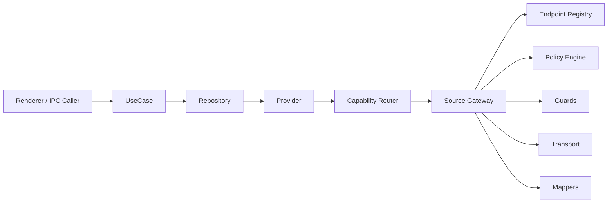
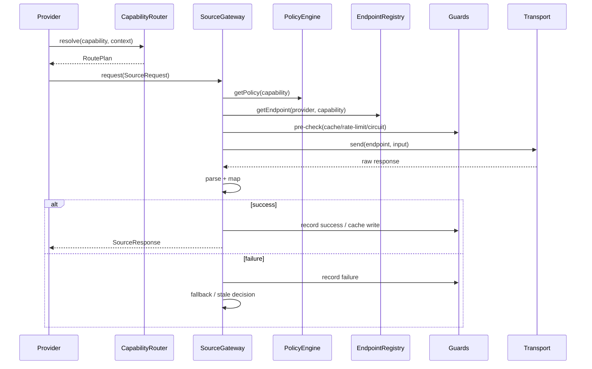

# 统一数据源网关实施 RFC

## 1. RFC 元信息

- RFC 名称：统一数据源网关实施 RFC
- RFC ID：`RFC-data-source-gateway-v1`
- 状态：Completed（全部 Phase 1-5 已实施，2026-05）
- 适用仓库：`DividendMonitor`
- 目标读者：核心开发者、后续接手实现者、代码审查者
- 关联文档：
  - `ARCHITECTURE.md`
  - `SDD.md`
  - `MULTI-ASSET-ARCHITECTURE.md`
  - `DATA-SOURCE-GATEWAY-ARCHITECTURE.md`

## 2. 摘要

本 RFC 在《统一数据源网关架构设计》的基础上，进一步给出可直接执行的实施方案，用于将当前分散在各个 adapter、use case 和基础 HTTP 工具中的外部数据请求逻辑，收敛为一套统一的数据源接入架构。

本 RFC 解决的问题包括：

1. 如何将第三方 API、URL、header、Referer 和 token 统一收口
2. 如何将直接 `fetch` 或手工 `getJson(url)` 迁移到统一网关
3. 如何定义 capability、endpoint、policy、guard 的边界
4. 如何在不推翻现有业务分层前提下完成渐进改造
5. 如何通过阶段验收、测试矩阵和回滚策略控制重构风险

本 RFC 的目标不是直接实现最终形态的“完整平台”，而是定义一条稳定、低风险、可逐步推进的工程路径。

## 3. 决策摘要

本 RFC 做出以下核心决策。

### 3.1 保留现有主干分层

保留当前主干：

```text
UI -> Hook / runtime service -> IPC / HTTP API -> UseCase -> Repository -> Provider -> Adapter -> Infra
```

新增的统一网关位于：

```text
Provider / Adapter 与 Infra HTTP 之间
```

即：

```text
Provider -> Capability Router -> Source Gateway -> Transport
```

### 3.2 不做“大而全插件系统”

第一阶段不设计运行时动态注册 provider 的复杂插件平台，只做静态注册表 + 策略路由 + 统一入口。

原因：

1. 当前 provider 数量有限
2. 当前最大的痛点是“分散”和“不一致”，不是“插件数量太多”
3. 先把 URL、入口、策略、保护收拢，收益已经足够大

### 3.3 先能力收口，再逐层迁移

以 capability 为中心迁移，而不是以“某个大类文件夹”整体迁移。

优先迁移顺序：

1. `asset.search`
2. `benchmark.kline`
3. `asset.quote`
4. `asset.kline`
5. `asset.profile`
6. `asset.dividend`
7. `valuation.snapshot`
8. `valuation.trend`

### 3.4 所有外部请求必须唯一入口

RFC 落地后，所有第三方请求都必须满足：

1. 不允许 use case 直接 `fetch`
2. 不允许 provider / adapter 直接拼第三方 URL 后调用 transport
3. 不允许在业务层散落 `try/catch + fallback`
4. 所有外部访问必须走 `SourceGateway.request()`

## 4. 当前现状与约束

### 4.1 当前已有的可复用基础

当前仓库中已有以下基础，可直接复用：

1. `AssetRepository` 与 `AssetProviderRegistry` 已承担资产路由职责
2. `adapter` 已经在做第三方响应解析与领域对象映射
3. `httpClient.ts` 已有基础 timeout 和部分 header 保护
4. `renderer` 与 `main` 边界清晰，不需要本次重构

### 4.2 当前痛点代码分布

当前需要重点收口的点包括：

1. `eastmoneyAShareDataSource.ts` 中的搜索、快照、分红、K 线 URL 拼接
2. `eastmoneyFundCatalogAdapter.ts` 中的搜索 URL 拼接和 token
3. `eastmoneyFundDetailDataSource.ts` 中的 HTML、quote、Tencent K 线、Sina K 线旁路请求
4. `runDividendReinvestmentBacktestForAsset.ts` 中的 benchmark 直连 `fetch`
5. 各类 `try/catch` 中的不一致 fallback

### 4.3 实施约束

本 RFC 必须遵守以下约束：

1. 不破坏现有 renderer API 契约
2. 不要求立即删除现有 `stock.*` 兼容接口
3. 不改变现有多资产领域模型方向
4. 改造过程中保持 `npm run typecheck` 与 `npm test` 可持续通过
5. 每阶段都必须具备单独可上线或可回退的边界

## 5. 目标范围

### 5.1 本 RFC 包含内容

本 RFC 包含：

1. 统一 endpoint registry
2. 统一 transport 包装
3. 统一 capability router
4. 统一 source gateway
5. 基础 fallback、错误模型、请求去重
6. 第一批关键链路迁移

### 5.2 本 RFC 暂不包含内容

本 RFC 暂不包含：

1. 运行时热更新 provider 配置
2. 可视化 provider 健康面板
3. 完整 observability 平台
4. 所有现存 adapter 一次性重写
5. 浏览器端直接访问第三方源的额外重构

## 6. 术语定义

### 6.1 Provider

上游数据来源，例如：

1. `eastmoney`
2. `tencent`
3. `sina`

### 6.2 Capability

系统对外部数据的业务能力需求，例如：

1. `asset.search`
2. `asset.profile`
3. `asset.quote`
4. `asset.dividend`
5. `asset.kline`
6. `valuation.snapshot`
7. `valuation.percentile`
8. `valuation.trend`
9. `benchmark.kline`

### 6.3 Endpoint

某个 provider 下的具体接口实例，例如：

1. `eastmoney.search.suggest`
2. `eastmoney.push2.quote`
3. `eastmoney.push2his.kline`
4. `eastmoney.valuation.percentile`
5. `eastmoney.valuation.trend`
6. `tencent.quote.snapshot`
7. `tencent.kline.index`
8. `tencent.kline.asset`
9. `sina.kline.daily`

### 6.4 Policy

请求策略，包括：

1. timeout
2. retry
3. degradeMode
4. cache
5. stale
6. circuit breaker
7. rate limit

### 6.5 Guard

执行时保护器，例如：

1. `RateLimiter`
2. `CircuitBreaker`
3. `ConcurrencyLimiter`
4. `RequestCache`

## 7. 目标架构

### 7.1 分层图



### 7.2 职责边界

#### UseCase

输入：

1. 页面请求
2. DTO

输出：

1. 领域结果
2. 页面所需组合结果

禁止：

1. 触达第三方 URL
2. 决定具体 provider

#### Repository / Provider

输入：

1. 资产标识
2. 业务能力需求

输出：

1. 资产详情
2. 搜索结果
3. 组合能力结果

禁止：

1. 编码第三方 URL
2. 自己管理 fallback 链

#### Source Gateway

输入：

1. 标准化 `SourceRequest`

输出：

1. 标准化 `SourceResponse`
2. 标准化 `SourceError`

负责：

1. endpoint 选择
2. 请求发送
3. retry / fallback / stale
4. 健康记录

## 8. 模块拆分与文件规划

### 8.1 新增目录结构

建议新增以下结构：

```text
src/main/infrastructure/data-sources/
  types/
    sourceTypes.ts
    sourceErrors.ts
  registry/
    endpointRegistry.ts
    eastmoneyEndpoints.ts
    tencentEndpoints.ts
    sinaEndpoints.ts
  router/
    capabilityRouter.ts
  policy/
    policyEngine.ts
  gateway/
    sourceGateway.ts
  guards/
    rateLimiter.ts
    circuitBreaker.ts
    concurrencyLimiter.ts
    requestCache.ts
  transport/
    httpTransport.ts
```

建议保留并逐步变薄的现有目录：

```text
src/main/adapters/
  eastmoney/
  sina/
```

建议新增 mapper 子目录：

```text
src/main/adapters/mappers/
  eastmoney/
  tencent/
  sina/
```

### 8.2 第一阶段必须新增的文件

第一阶段强制新增：

1. `sourceTypes.ts`
2. `sourceErrors.ts`
3. `endpointRegistry.ts`
4. `eastmoneyEndpoints.ts`
5. `tencentEndpoints.ts`
6. `sinaEndpoints.ts`
7. `httpTransport.ts`
8. `capabilityRouter.ts`
9. `policyEngine.ts`
10. `sourceGateway.ts`

### 8.3 第二阶段建议新增的文件

第二阶段建议新增：

1. `requestCache.ts`
2. `rateLimiter.ts`
3. `circuitBreaker.ts`
4. `concurrencyLimiter.ts`

## 9. 数据结构与接口草案

### 9.1 基础类型

```ts
export type ProviderKey = 'eastmoney' | 'tencent' | 'sina'

export type Capability =
  | 'asset.search'
  | 'asset.profile'
  | 'asset.quote'
  | 'asset.dividend'
  | 'asset.kline'
  | 'valuation.snapshot'
  | 'valuation.trend'
  | 'benchmark.kline'

export type DegradeMode = 'strict' | 'fallback' | 'stale-while-error'

export type ParserKind = 'json' | 'text'
```

### 9.2 Endpoint 定义

```ts
export type EndpointDefinition<TInput = unknown> = {
  id: string
  provider: ProviderKey
  capability: Capability
  parser: ParserKind
  method: 'GET'
  timeoutMs: number
  headers?: Record<string, string>
  buildUrl: (input: TInput) => string
  mapperId: string
}
```

### 9.3 SourceRequest / SourceResponse

```ts
export type SourceRequest<TInput> = {
  capability: Capability
  input: TInput
  providerHint?: ProviderKey
  fallbackProviders?: ProviderKey[]
  degradeMode?: DegradeMode
  cacheKey?: string
  cacheTtlMs?: number
  staleTtlMs?: number
  tags?: string[]
}

export type SourceResponse<TData> = {
  data: TData
  provider: ProviderKey
  endpointId: string
  isFallback: boolean
  isStale: boolean
  fetchedAt: string
}
```

### 9.4 RoutePlan

```ts
export type RoutePlan = {
  primary: ProviderKey
  fallbacks: ProviderKey[]
  degradeMode: DegradeMode
}
```

### 9.5 RequestPolicy

```ts
export type RequestPolicy = {
  retryCount: number
  timeoutMs?: number
  degradeMode: DegradeMode
  useInFlightDedupe: boolean
  useCircuitBreaker: boolean
  useRateLimit: boolean
  cacheTtlMs?: number
  staleTtlMs?: number
}
```

### 9.6 错误模型

```ts
export type SourceErrorCode =
  | 'NETWORK'
  | 'TIMEOUT'
  | 'RATE_LIMITED'
  | 'UPSTREAM_4XX'
  | 'UPSTREAM_5XX'
  | 'PARSE_FAILED'
  | 'CIRCUIT_OPEN'
  | 'NO_FALLBACK_AVAILABLE'

export class SourceError extends Error {
  constructor(
    message: string,
    public readonly code: SourceErrorCode,
    public readonly provider: ProviderKey,
    public readonly endpointId: string,
    public readonly retryable: boolean,
    public readonly cause?: unknown
  ) {
    super(message)
  }
}
```

## 10. Endpoint Registry 设计

### 10.1 设计要求

Registry 必须满足：

1. 所有第三方 endpoint 都有唯一 ID
2. capability 与 provider 的映射可查
3. URL 构造逻辑集中
4. token、默认 headers、parser 配置集中

### 10.2 示例

```ts
export const eastmoneySearchSuggestEndpoint: EndpointDefinition<{ keyword: string; count: number }> = {
  id: 'eastmoney.search.suggest',
  provider: 'eastmoney',
  capability: 'asset.search',
  parser: 'json',
  method: 'GET',
  timeoutMs: 8000,
  headers: {},
  buildUrl: ({ keyword, count }) =>
    `https://searchapi.eastmoney.com/api/suggest/get?input=${encodeURIComponent(keyword)}&type=14&token=${SEARCH_TOKEN}&count=${count}`,
  mapperId: 'eastmoney.search.suggest'
}
```

### 10.3 实施要求

第一阶段至少收口以下 endpoint：

1. Eastmoney 搜索 suggest
2. Eastmoney push2 quote
3. Eastmoney push2his kline
4. Eastmoney dividend 数据中心
5. Tencent ETF / index K 线
6. Sina daily K 线

## 11. Capability Router 设计

### 11.1 设计目标

Router 用于根据 capability 和资产上下文，得出请求路线。

### 11.2 输入上下文

```ts
type RouteContext = {
  assetType?: 'STOCK' | 'ETF' | 'FUND'
  market?: 'A_SHARE'
  code?: string
}
```

### 11.3 路由规则建议

#### 股票

- `asset.search` -> `eastmoney`
- `asset.quote` -> `eastmoney`, fallback `tencent`
- `asset.kline` -> `eastmoney`, fallback `sina`
- `asset.dividend` -> `eastmoney`
- `valuation.*` -> `eastmoney`

#### ETF

- `asset.profile` -> `eastmoney`
- `asset.quote` -> `eastmoney`
- `asset.kline` -> `tencent`, fallback `sina`
- `asset.dividend` -> `eastmoney`

#### FUND

- `asset.profile` -> `eastmoney`
- `asset.quote` -> `eastmoney`
- `asset.kline` -> `sina`, fallback `eastmoney`
- `asset.dividend` -> `eastmoney`

#### Benchmark

- `benchmark.kline` -> `tencent`, fallback `sina`

### 11.4 接口示意

```ts
export interface CapabilityRouter {
  resolve(capability: Capability, context: RouteContext): RoutePlan
}
```

## 12. Policy Engine 设计

### 12.1 设计目标

Policy Engine 负责“同一 capability 用什么执行策略”，避免 adapter 自己散落策略。

### 12.2 推荐策略表

| capability | retry | degradeMode | cache | stale | 说明 |
|------------|-------|-------------|-------|-------|------|
| `asset.search` | 0 | `fallback` | 短缓存 | 否 | 搜索要快，不要陈旧结果 |
| `asset.quote` | 1 | `fallback` | 短缓存 | 是 | 行情适合短缓存和 stale |
| `asset.kline` | 1 | `stale-while-error` | 中缓存 | 是 | K 线较稳定，适合兜底 |
| `asset.profile` | 0 | `fallback` | 中缓存 | 否 | 静态资料可缓存，但不建议 stale |
| `asset.dividend` | 0 | `fallback` | 中缓存 | 否 | 分红记录更新较少 |
| `valuation.snapshot` | 1 | `fallback` | 短缓存 | 是 | 快照适合兜底 |
| `valuation.trend` | 0 | `fallback` | 中缓存 | 否 | 历史趋势容忍短时失败 |
| `benchmark.kline` | 1 | `fallback` | 中缓存 | 是 | 不阻断主回测 |

### 12.3 接口示意

```ts
export interface PolicyEngine {
  getPolicy(capability: Capability): RequestPolicy
}
```

## 13. Source Gateway 设计

### 13.1 目标

网关是统一外部请求入口。

### 13.2 接口

```ts
export interface SourceGateway {
  request<TInput, TOutput>(request: SourceRequest<TInput>): Promise<SourceResponse<TOutput>>
}
```

### 13.3 处理流程



### 13.4 参考伪代码

```ts
async function request<TInput, TOutput>(req: SourceRequest<TInput>): Promise<SourceResponse<TOutput>> {
  const routePlan = capabilityRouter.resolve(req.capability, inferRouteContext(req.input))
  const policy = policyEngine.getPolicy(req.capability)
  const providers = buildProviderChain(req, routePlan)

  for (let index = 0; index < providers.length; index += 1) {
    const provider = providers[index]
    const endpoint = endpointRegistry.get(provider, req.capability)

    try {
      await guards.beforeRequest(provider, endpoint, req, policy)

      const raw = await transport.send(endpoint, req.input, policy)
      const mapped = mapResponse<TOutput>(endpoint.mapperId, raw, req.input)

      await guards.onSuccess(provider, endpoint, req, mapped, policy)

      return {
        data: mapped,
        provider,
        endpointId: endpoint.id,
        isFallback: index > 0,
        isStale: false,
        fetchedAt: new Date().toISOString()
      }
    } catch (error) {
      await guards.onFailure(provider, endpoint, req, error, policy)

      const stale = await guards.tryGetStale<TOutput>(provider, endpoint, req, policy)
      if (stale) {
        return {
          data: stale,
          provider,
          endpointId: endpoint.id,
          isFallback: index > 0,
          isStale: true,
          fetchedAt: new Date().toISOString()
        }
      }
    }
  }

  throw buildNoFallbackError(req)
}
```

## 14. Guard 设计

### 14.1 RequestCache

#### 目标

1. 避免短时间内相同请求重复发送
2. 为部分能力提供 stale 数据兜底

#### 能力

1. in-flight 去重
2. TTL 缓存
3. stale 缓存

#### 最小实现建议

第一阶段先实现：

1. `Map` 级别 in-flight 去重
2. 内存 TTL 缓存

后续再接入持久化缓存。

### 14.2 RateLimiter

#### 目标

按 provider 做速率限制，避免单个 provider 被打爆。

#### 最小实现建议

第一阶段可简单实现为：

1. provider 级 token bucket
2. 默认每秒 2 到 5 个请求

### 14.3 CircuitBreaker

#### 目标

连续失败达到阈值后，短时间内直接跳过该 provider。

#### 状态

```ts
type CircuitState = 'closed' | 'open' | 'half-open'
```

#### 最小实现建议

第一阶段先只记录失败次数和冷却时间，不必追求完整工业级熔断器。

### 14.4 ConcurrencyLimiter

#### 目标

限制某个 provider 或 capability 的最大并发，避免聚合详情时产生过多 socket。

#### 建议默认值

1. `eastmoney`: 4
2. `tencent`: 2
3. `sina`: 2

## 15. Mapper 设计

### 15.1 原则

Mapper 只做：

1. 原始响应校验
2. 第三方字段解析
3. 转换为领域或中间结构

Mapper 不做：

1. fallback 决策
2. retry
3. transport 发送

### 15.2 迁移建议

现有 adapter 中的以下逻辑适合迁移为 mapper：

1. Eastmoney suggest 响应解析
2. Eastmoney push2 / push2his 响应解析
3. Tencent quote / kline 响应解析
4. Fund HTML 字段提取与分红事件解析
5. Sina K 线响应解析

## 16. 对现有代码的具体改造计划

### 16.1 Phase 1：基础设施落地

#### 范围

1. 新建 `data-sources` 目录
2. 增加基础 types / registry / transport / router / policy / gateway
3. 不立即删旧 adapter

#### 变更清单

1. 新增 endpoint registry 和 endpoint definitions
2. 将 `httpClient.ts` 能力下沉到 `httpTransport.ts`
3. 增加 `SourceError`
4. 增加 `SourceGateway`

#### 验收标准

1. 新增模块类型检查通过
2. 旧逻辑行为不变
3. 至少能通过一个 endpoint 完成端到端调用

### 16.2 Phase 2：迁移 benchmark.kline

#### 原因

这是当前最独立、风险最低、价值很高的一条链路。

#### 范围

1. `runDividendReinvestmentBacktestForAsset.ts` 不再直接 `fetch`
2. benchmark 请求改走 `SourceGateway`
3. Tencent 和 Sina benchmark endpoint 接入 router / policy

#### 验收标准

1. benchmark 行为与当前等价
2. 主源失败时可切备用源或返回无 benchmark
3. use case 不再包含第三方 URL

### 16.3 Phase 3：迁移 asset.search

#### 原因

搜索入口独立，易验证，且当前存在 token 和 URL 重复定义。

#### 范围

1. 股票搜索和基金搜索统一接入 `asset.search`
2. Eastmoney suggest URL 和 token 移入 registry
3. 搜索结果解析迁移到 mapper

#### 验收标准

1. 股票和基金搜索结果与当前兼容
2. 不再重复定义 suggest token
3. 搜索路径不再在 adapter 中手拼 URL

### 16.4 Phase 4：迁移 asset.quote / asset.kline

#### 范围

1. 股票行情与 K 线迁移到网关
2. ETF / FUND K 线迁移到网关
3. 统一 fallback 链

#### 验收标准

1. ETF 和股票详情仍正常工作
2. K 线 fallback 行为可控
3. 直连 `fetch` 清零

### 16.5 Phase 5：迁移 profile / dividend / valuation

#### 范围

1. Eastmoney HTML profile
2. Eastmoney dividend records
3. Valuation snapshot / trend

#### 验收标准

1. 各能力迁移完成
2. adapter 主要剩 mapper 和聚合逻辑
3. provider 主要表达能力编排

## 17. 测试策略

### 17.1 单元测试

应新增以下测试类型：

1. endpoint URL 构造测试
2. capability router 路由测试
3. policy engine 策略测试
4. source gateway fallback 测试
5. source error 分类测试
6. request cache 去重测试
7. circuit breaker 状态测试

### 17.2 集成测试

建议新增或补充：

1. `benchmark.kline` 迁移后的 use case 集成测试
2. `asset.search` 统一入口测试
3. `asset.kline` 主源失败时的 fallback 集成测试

### 17.3 回归测试重点

重点关注以下行为不回退：

1. 股票搜索结果
2. ETF / FUND 搜索结果
3. 个股详情页价格与分红
4. ETF 详情页 K 线
5. benchmark 回测曲线
6. 估值图表

### 17.4 手动验证矩阵

| 场景 | 预期 |
|------|------|
| 股票搜索正常 | 返回与当前一致的股票候选 |
| 基金搜索正常 | 返回与当前一致的 ETF / FUND 候选 |
| 腾讯 K 线失败 | 自动切换备用源或合理降级 |
| benchmark 主源失败 | 回测仍可运行，benchmark 缺失或切备用 |
| 估值接口失败 | 详情页主体仍可打开，估值区域缺失 |

## 18. 日志与可观测性

### 18.1 日志最小要求

至少记录以下字段：

1. `capability`
2. `provider`
3. `endpointId`
4. `durationMs`
5. `success`
6. `isFallback`
7. `isStale`
8. `errorCode`

### 18.2 日志建议格式

```ts
logger.info('source_request_done', {
  capability,
  provider,
  endpointId,
  durationMs,
  success,
  isFallback,
  isStale
})
```

### 18.3 失败诊断最小要求

对于失败请求，至少能回答：

1. 请求的是哪个 capability
2. 打到了哪个 provider / endpoint
3. 为什么失败
4. 有没有执行 fallback
5. fallback 是否成功

## 19. 回滚策略

### 19.1 代码层回滚

每个 phase 都应独立可回滚。

建议方式：

1. 迁移某条能力链路时，保留旧实现到该 phase 验证完成
2. 通过 provider 内部开关或临时 feature flag 切回旧链路
3. 不要在同一个提交中同时迁移过多 capability

### 19.2 运行层回滚

对于单 capability 的迁移，如出现问题，应支持：

1. 快速切回旧 adapter 实现
2. 暂时停用新 gateway 路径

## 20. 风险清单

### 20.1 风险：抽象过早

说明：

如果过早把所有 provider 都做成复杂插件，会增加代码复杂度。

应对：

1. 先做静态 registry
2. 先做最小 policy / gateway / guards

### 20.2 风险：行为回退不一致

说明：

迁移后搜索、K 线、分红口径可能出现细微差异。

应对：

1. 先迁移独立能力
2. 建立回归测试
3. 保留旧路径对照

### 20.3 风险：fallback 产生误导结果

说明：

备用源字段口径可能与主源不同。

应对：

1. fallback 仅用于同能力近似等价源
2. 返回结果明确带 `isFallback`
3. 必要时在上层做 partial 标记

## 21. 开放问题

以下问题可在实施过程中继续收敛，但不阻塞本 RFC 的第一阶段推进：

1. `RequestCache` 是否需要持久化到 SQLite
2. provider 健康状态是否需要暴露到调试页
3. `valuation` 是否需要单独的 provider 能力分组
4. `local-http` 是否也应该纳入同样的 endpoint / gateway 体系

## 22. 实施完成判定

当前状态：**所有条件已满足**（2026-05）。

1. ✅ 所有第三方 URL 定义集中到 registry（`eastmoneyEndpoints.ts` / `tencentEndpoints.ts` / `sinaEndpoints.ts`）
2. ✅ 所有外部请求统一通过 `SourceGateway`（`getDefaultSourceGateway().request()`）
3. ✅ use case 中不再存在直接 `fetch`（`runDividendReinvestmentBacktestForAsset.ts` 已迁移）
4. ✅ 搜索、benchmark、行情、K 线、分红、估值全部主链路已迁移
5. ✅ 新增测试覆盖路由、策略、fallback 和错误分类（`sourceGateway.test.ts` / `circuitBreaker.test.ts` / `rateLimiter.test.ts`）
6. ✅ 文档与代码结构保持一致

### 实际实施与 RFC 的主要差异

| RFC 约定 | 实际实现 | 原因 |
|----------|---------|------|
| 目录名 `data-sources/` | `dataSources/` | 本项目统一使用 camelCase 目录名 |
| `ParserKind = 'json' \| 'text'` | `'json' \| 'text' \| 'gbk'` | 腾讯行情需要 GBK 编码 |
| `EndpointDefinition.mapperId` | `EndpointDefinition.mapResponse` | 将 mapper 内联到 endpoint 定义中，减少跳转 |
| mapper 独立子目录 `adapters/mappers/` | mapper 逻辑保留在 `endpoint.mapResponse` 中 | 实际复杂度不需要额外的 mapper 文件 |
| `ConcurrencyLimiter` max 按 provider 和 capability 分级 | 统一 `maxPerProvider = 4` | 简化配置 |
| `RateLimiter` 每秒 2-5 请求 | token bucket: 初始 5, 每秒补充 5 | token bucket 更简洁 |
| `CircuitBreaker` 默认启用 | 策略表中所有能力 `useCircuitBreaker: false` | 当前网络环境下误熔断风险大于收益 |

## 23. 附录：建议实施顺序

建议按以下顺序实施，而不是并行大改：

1. 建基础 types / errors / registry / transport
2. 建 router / policy / gateway
3. 先迁移 `benchmark.kline`
4. 再迁移 `asset.search`
5. 再迁移 `asset.quote`
6. 再迁移 `asset.kline`
7. 最后迁移 `profile / dividend / valuation`

这样做的原因是：

1. 改动面从小到大
2. 验证路径从独立到核心
3. 失败时更容易回退

## 24. 结论

本 RFC 的重点不是再增加一层抽象名词，而是为后续重构提供一份可以按章节直接执行的工程说明书。

落地后，项目会从“每个 adapter 各自处理 URL、源选择和异常恢复”的状态，演进为：

```text
业务层声明能力
路由层选择来源
网关层统一请求
策略层统一降级
保护层统一兜底
```

这将显著降低第三方源变动带来的维护成本，并为后续继续扩展更多资产类别、更多 provider 和更稳定的运行时保护能力打下基础。
