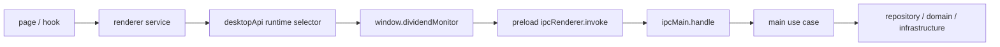
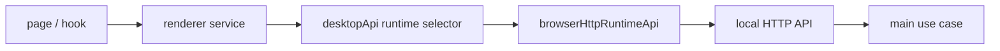
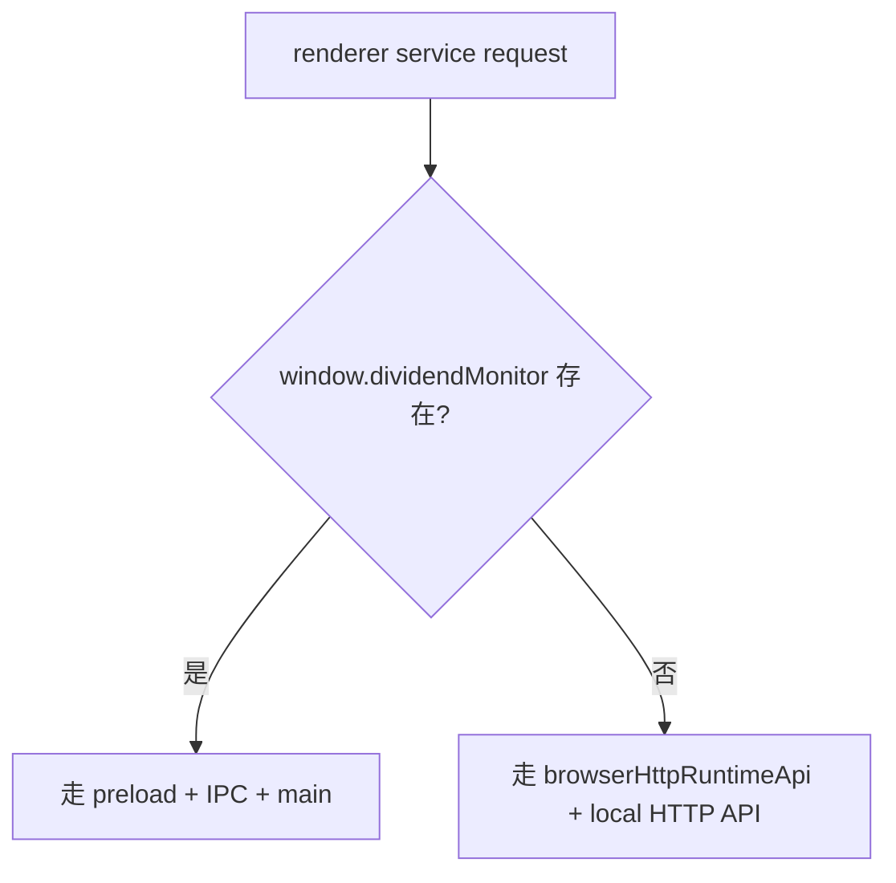
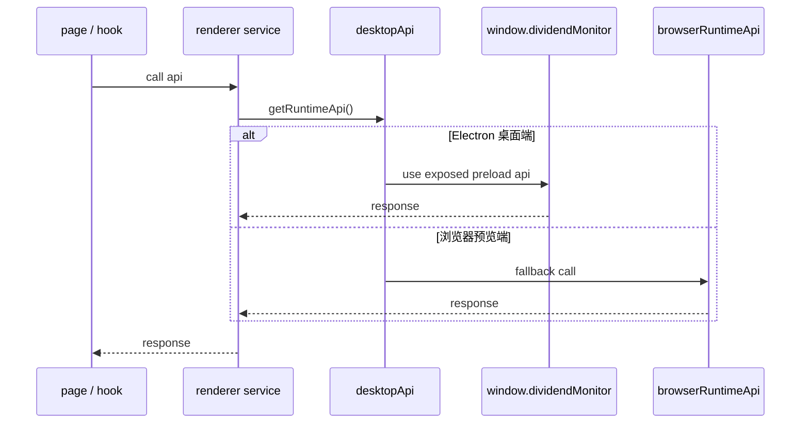

# 收息佬 IPC 与运行时接口清单

## 1. 文档目标

本文档记录当前仓库里已经落地的：

1. preload 暴露接口
2. Electron IPC channel
3. 渲染层运行时选择逻辑
4. 桌面端与浏览器预览端的能力差异

本文档只描述当前实现，不描述未来理想态。

## 2. 总览

当前渲染层访问能力分为两条路径：

### 2.1 Electron 桌面端

```text
page / hook
  -> renderer service
  -> desktopApi runtime selector
  -> window.dividendMonitor
  -> preload ipcRenderer.invoke(...)
  -> ipcMain.handle(...)
  -> main use case
  -> repository / domain / infrastructure
```

### 2.1.1 Electron 桌面端调用图



### 2.2 浏览器预览端

```text
page / hook
  -> renderer service
  -> desktopApi runtime selector
  -> browserHttpRuntimeApi
  -> local HTTP API
  -> main use case
  -> repository / domain / infrastructure
```

### 2.2.1 浏览器预览端调用图



说明：

1. 浏览器预览端不具备 `window.dividendMonitor`
2. 浏览器预览端默认通过本地 HTTP API 访问真实主进程用例
3. 若 URL 带 `runtime=mock`，才显式退回 `browserRuntimeApi`

### 2.3 运行时分流图



## 3. 类型契约入口

当前共享类型定义位于：

- `shared/contracts/api.ts`

核心顶层接口为：

```ts
interface DividendMonitorApi {
  asset: {
    search(request: AssetSearchRequestDto): Promise<AssetSearchItemDto[]>
    getDetail(request: AssetQueryDto): Promise<AssetDetailDto>
    compare(request: AssetCompareRequestDto): Promise<AssetComparisonRowDto[]>
  }
  stock: {
    search(keyword: string): Promise<StockSearchItemDto[]>
    getDetail(symbol: string): Promise<StockDetailDto>
    compare(symbols: string[]): Promise<ComparisonRowDto[]>
  }
  watchlist: {
    list(): Promise<WatchlistEntryDto[]>
    add(symbol: string): Promise<void>
    remove(symbol: string): Promise<void>
    addAsset(request: WatchlistAddRequestDto): Promise<void>
    removeAsset(assetKey: AssetKey): Promise<void>
  }
  calculation: {
    getHistoricalYield(symbol: string): Promise<HistoricalYieldResponseDto>
    estimateFutureYield(symbol: string): Promise<FutureYieldResponseDto>
    runDividendReinvestmentBacktest(symbol: string, buyDate: string): Promise<BacktestResultDto>
    getHistoricalYieldForAsset(request: AssetQueryDto): Promise<HistoricalYieldResponseDto>
    estimateFutureYieldForAsset(request: AssetQueryDto): Promise<FutureYieldResponseDto>
    runDividendReinvestmentBacktestForAsset(request: AssetBacktestRequestDto): Promise<BacktestResultDto>
  }
  portfolio: {
    list(): Promise<PortfolioPositionDto[]>
    upsert(request: PortfolioPositionUpsertDto): Promise<void>
    remove(id: string): Promise<void>
    removeByAsset(request: AssetQueryDto): Promise<void>
    replaceByAsset(request: PortfolioPositionReplaceByAssetDto): Promise<void>
  }
}
```

## 4. Preload 暴露接口

当前 preload 文件：

- `src/preload/index.ts`

当前通过 `contextBridge.exposeInMainWorld('dividendMonitor', api)` 暴露以下命名空间：

### 4.0 API 命名空间图

```mermaid
flowchart TB
    API[window.dividendMonitor]
    API --> Asset[asset]
    API --> Stock[stock]
    API --> Watchlist[watchlist]
    API --> Calculation[calculation]
    API --> Portfolio[portfolio]

    Asset --> AssetSearch[search]
    Asset --> AssetDetail[getDetail]
    Asset --> AssetCompare[compare]

    Stock --> StockSearch[search]
    Stock --> StockDetail[getDetail]
    Stock --> StockCompare[compare]

    Watchlist --> WatchlistList[list]
    Watchlist --> WatchlistAdd[add]
    Watchlist --> WatchlistRemove[remove]
    Watchlist --> WatchlistAddAsset[addAsset]
    Watchlist --> WatchlistRemoveAsset[removeAsset]

    Calculation --> CalcHistory[getHistoricalYield]
    Calculation --> CalcEstimate[estimateFutureYield]
    Calculation --> CalcBacktest[runDividendReinvestmentBacktest]
    Calculation --> CalcHistoryAsset[getHistoricalYieldForAsset]
    Calculation --> CalcEstimateAsset[estimateFutureYieldForAsset]
    Calculation --> CalcBacktestAsset[runDividendReinvestmentBacktestForAsset]

    Portfolio --> PortfolioList[list]
    Portfolio --> PortfolioUpsert[upsert]
    Portfolio --> PortfolioRemove[remove]
    Portfolio --> PortfolioRemoveByAsset[removeByAsset]
    Portfolio --> PortfolioReplaceByAsset[replaceByAsset]
```



### 4.1 `stock`

- `search(keyword)`
- `getDetail(symbol)`
- `compare(symbols)`

### 4.2 `watchlist`

- `list()`
- `add(symbol)`
- `remove(symbol)`

### 4.3 `calculation`

- `getHistoricalYield(symbol)`
- `estimateFutureYield(symbol)`
- `runDividendReinvestmentBacktest(symbol, buyDate)`

## 5. IPC Channel 清单

## 5.1 Stock

文件：

- `src/main/ipc/channels/stockChannels.ts`

当前 channel：

- `stock:search`
  - 入参：`keyword: string`
  - 用例：`searchStocks`
- `stock:get-detail`
  - 入参：`symbol: string`
  - 用例：`getStockDetail`
- `stock:compare`
  - 入参：`symbols: string[]`
  - 用例：`compareStocks`

## 5.2 Watchlist

文件：

- `src/main/ipc/channels/watchlistChannels.ts`

当前 channel：

- `watchlist:list`
  - 入参：无
  - 用例：`listWatchlist`
- `watchlist:add`
  - 入参：`symbol: string`
  - 用例：`addWatchlistItem`
- `watchlist:remove`
  - 入参：`symbol: string`
  - 用例：`removeWatchlistItem`

## 5.3 Calculation

文件：

- `src/main/ipc/channels/calculationChannels.ts`

当前 channel：

- `calculation:historical-yield`
  - 入参：`symbol: string`
  - 用例：`getHistoricalYield`
- `calculation:estimate-future-yield`
  - 入参：`symbol: string`
  - 用例：`estimateFutureYield`
- `calculation:run-dividend-reinvestment-backtest`
  - 入参：
    - `symbol: string`
    - `buyDate: string`
  - 用例：`runDividendReinvestmentBacktest`

## 6. 渲染层运行时选择

当前运行时选择入口：

- `src/renderer/src/services/desktopApi.ts`

当前行为：

1. 若存在 `window.dividendMonitor`
   - 认为当前运行于 Electron 桌面端
   - 走 preload + IPC
2. 若不存在 `window.dividendMonitor`
   - 回退到 `browserRuntimeApi`
   - 使用浏览器 fallback 能力

### 6.1 运行时选择图



## 7. 浏览器 Fallback 覆盖范围

当前浏览器默认运行时文件：

- `src/renderer/src/services/browserHttpRuntimeApi.ts`

调试态 mock runtime 文件：

- `src/renderer/src/services/browserRuntimeApi.ts`

当前覆盖内容：

### 7.1 `stock`

- `search`
- `getDetail`
- `compare`

当前数据来源：

1. 内置 mock 股票详情数据
2. 当前内置示例代码：
   - `600519`
   - `000651`
   - `601318`
3. `getDetail` 与 `compare` 当前已覆盖 `PE/PB`、`10Y/20Y` 估值分位的最小 mock 能力

### 7.2 `watchlist`

- `list`
- `add`
- `remove`

当前存储方式：

1. 浏览器端默认通过本地 HTTP API 调主进程 `listWatchlist/addWatchlistAsset/removeWatchlistAsset`
2. SQLite 中的 `watchlist_items` 是双端共享数据源

### 7.3 `calculation`

- `getHistoricalYield`
- `estimateFutureYield`
- `runDividendReinvestmentBacktest`

当前数据来源：

1. 浏览器端默认通过本地 HTTP API 调主进程计算用例
2. 仅在显式 `runtime=mock` 时才回退到 mock 计算结果

## 8. 桌面端存储现状

当前桌面端自选持久化：

- 仓库：`src/main/repositories/watchlistRepository.ts`
- 数据库设施：`src/main/infrastructure/db/sqlite.ts`

当前状态：

1. 已从 JSON 文件切换为 SQLite
2. 当前使用 Node 内建 `node:sqlite`
3. 当前未在 `package.json` 中显式安装第三方 SQLite npm 包
4. 当前 schema 已覆盖：
   - `watchlist_items`
   - `portfolio_positions`
   - `app_settings`

## 9. 开发态数据目录

当前开发态 Electron 数据目录重定向逻辑位于：

- `src/main/index.ts`

当前行为：

1. 若检测到 `ELECTRON_RENDERER_URL`
2. 则把 `app.getPath('userData')` 重定向到项目内 `.runtime-data`

目的：

1. 避免开发环境继续写系统 `Roaming` 目录
2. 规避开发态权限与沙箱限制
3. 便于直接查看数据库文件和运行数据

## 10. 当前已知边界

1. Electron 与浏览器预览当前共享同一批主进程 use case，但接入层仍是 IPC 与 HTTP 两条传输通道
2. 浏览器 mock runtime 仍保留为显式调试开关，不再是默认链路
3. `node:sqlite` 方案当前可运行，但从依赖可见性角度看仍不是最终理想方案
4. 工作台持仓已从前端 localStorage 升级为 SQLite 持久化，并带一次性迁移逻辑
5. 文档中凡写“当前实现”，均以本文件和仓库现状为准

## 11. 建议后续补充

后续若继续演进，建议补充：

1. 请求参数校验规则文档
2. 错误码 / 用户可见错误信息清单
3. 数据源适配层接口文档
4. 显式 SQLite 依赖切换决策文档
