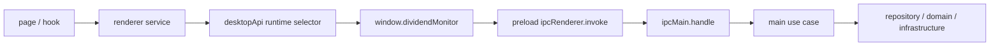
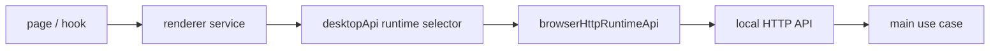
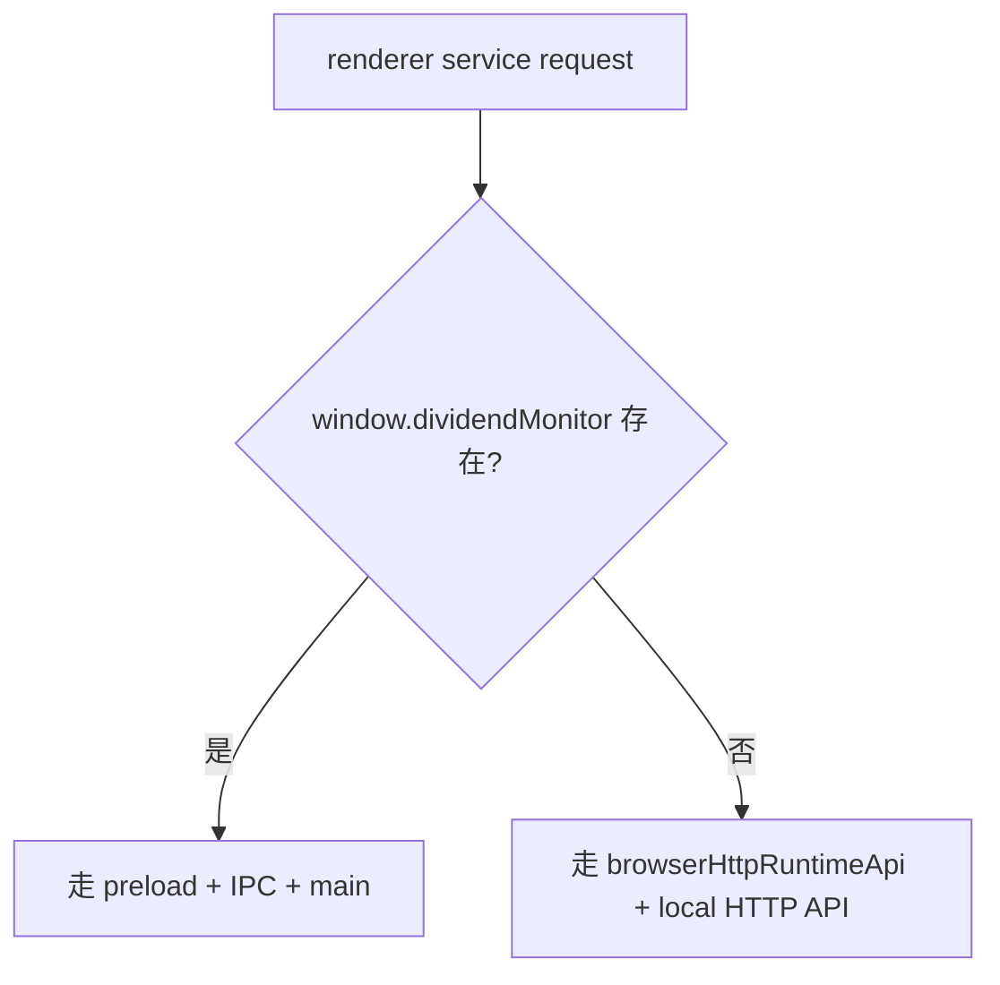
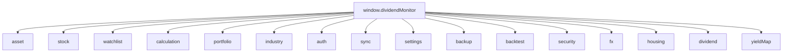
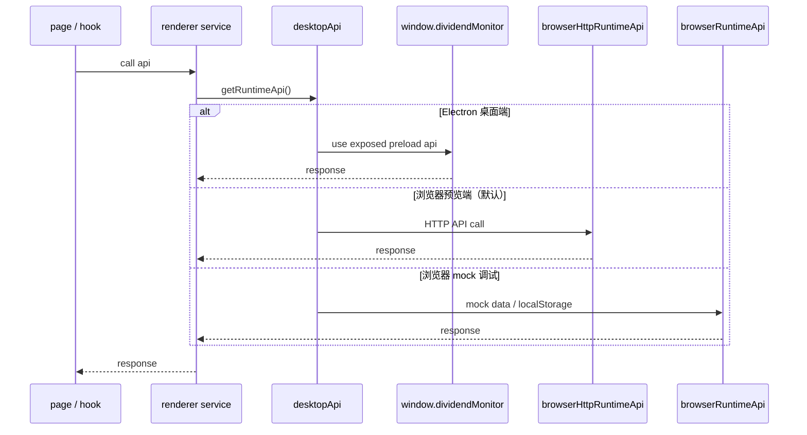

# 收息佬 IPC 与运行时接口清单

## 1. 文档目标

本文档记录当前仓库里已经落地的：

1. preload 暴露接口
2. Electron IPC channel
3. 渲染层运行时选择逻辑
4. 桌面端与浏览器预览端的能力差异

本文档只描述当前实现，不描述未来理想态。权威契约来源：`shared/contracts/api.ts`（DTO 类型）与 `src/preload/index.ts`（命名空间与方法）。

## 2. 总览

当前渲染层访问能力分为两条路径：

### 2.1 Electron 桌面端

```text
page / hook
  -> renderer service
  -> desktopApi runtime selector
  -> window.dividendMonitor
  -> preload ipcRenderer.invoke(...)
  -> ipcMain.handle(...)
  -> main use case
  -> repository / domain / infrastructure
```

### 2.1.1 Electron 桌面端调用图


```mermaid
flowchart LR
    Page[page / hook] --> Service[renderer service]
    Service --> Selector[desktopApi runtime selector]
    Selector --> WindowApi[window.dividendMonitor]
    WindowApi --> Preload[preload ipcRenderer.invoke]
    Preload --> IPC[ipcMain.handle]
    IPC --> Main[main use case]
    Main --> Repo[repository / domain / infrastructure]
```

### 2.2 浏览器预览端

```text
page / hook
  -> renderer service
  -> desktopApi runtime selector
  -> browserHttpRuntimeApi
  -> local HTTP API
  -> main use case
  -> repository / domain / infrastructure
```

### 2.2.1 浏览器预览端调用图


```mermaid
flowchart LR
    Page[page / hook] --> Service[renderer service]
    Service --> Selector[desktopApi runtime selector]
    Selector --> Browser[browserHttpRuntimeApi]
    Browser --> Http[local HTTP API]
    Http --> Main[main use case]
```

说明：

1. 浏览器预览端不具备 `window.dividendMonitor`
2. 浏览器预览端默认通过本地 HTTP API 访问真实主进程用例
3. 若 URL 带 `runtime=mock`，才显式退回 `browserRuntimeApi`

### 2.3 运行时分流图


```mermaid
flowchart TD
    Start[renderer service request] --> Check{window.dividendMonitor 存在?}
    Check -->|是| Desktop[走 preload + IPC + main]
    Check -->|否| Browser[走 browserHttpRuntimeApi + local HTTP API]
```

## 3. 类型契约入口

当前共享类型定义位于：

- `shared/contracts/api.ts`

该文件同时是 IPC 与 HTTP 的唯一共享 DTO 源，具体 DTO 类型随功能域分散在对应命名空间章节中，本文档不再重复贴接口签名。

## 4. Preload 暴露接口

当前 preload 文件：

- `src/preload/index.ts`

通过 `contextBridge.exposeInMainWorld('dividendMonitor', api)` 暴露以下命名空间：

### 4.0 API 命名空间图


```mermaid
flowchart TB
    API[window.dividendMonitor]
    API --> Asset[asset]
    API --> Stock[stock]
    API --> Watchlist[watchlist]
    API --> Calculation[calculation]
    API --> Portfolio[portfolio]
    API --> Industry[industry]
    API --> Auth[auth]
    API --> Sync[sync]
    API --> Settings[settings]
    API --> Backup[backup]
    API --> Backtest[backtest]
    API --> Security[security]
    API --> Fx[fx]
    API --> Housing[housing]
    API --> Dividend[dividend]
    API --> YieldMap[yieldMap]
```

### 4.1 命名空间与方法一览

| 命名空间 | 方法 | 对应 IPC channel |
|----------|------|-------------------|
| `auth` | `login(email, password)` | `auth:login` |
| | `register(email, password)` | `auth:register` |
| | `logout()` | `auth:logout` |
| | `getSession()` | `auth:getSession` |
| | `updatePassword(newPassword)` | `auth:update-password` |
| | `onAuthStateChange(callback)` | 事件 `auth:state-changed` |
| `sync` | `syncData(direction)` | `sync:data` |
| | `onStatusChange(callback)` | 事件 `sync:status-changed` |
| `asset` | `search(request)` / `getDetail(request)` / `compare(request)` | `asset:search` / `asset:get-detail` / `asset:compare` |
| `stock` | `search(keyword)` / `getDetail(symbol)` / `compare(symbols)` | `stock:search` / `stock:get-detail` / `stock:compare` |
| `watchlist` | `list()` / `add(symbol)` / `remove(symbol)` | `watchlist:list` / `watchlist:add` / `watchlist:remove` |
| | `addAsset(request)` / `removeAsset(assetKey)` | `watchlist:add-asset` / `watchlist:remove-asset` |
| | `listGroups()` / `createGroup(request)` / `updateGroup(id, request)` / `deleteGroup(id)` | `watchlist:list-groups` / `watchlist:create-group` / `watchlist:update-group` / `watchlist:delete-group` |
| | `addToGroup(request)` / `removeFromGroup(request)` | `watchlist:add-to-group` / `watchlist:remove-from-group` |
| | `listGroupAssets(groupId)` / `getAssetGroupIds(assetKey)` | `watchlist:list-group-assets` / `watchlist:get-asset-group-ids` |
| `calculation` | `getHistoricalYield(symbol)` 等 3 个 symbol 版 | `calculation:historical-yield` / `calculation:estimate-future-yield` / `calculation:run-dividend-reinvestment-backtest` |
| | `getHistoricalYieldForAsset(request)` 等 3 个 asset 版 | `calculation:historical-yield-for-asset` / `calculation:estimate-future-yield-for-asset` / `calculation:run-dividend-reinvestment-backtest-for-asset` |
| `portfolio` | `list()` / `upsert(request)` / `remove(id)` / `removeByAsset(request)` / `replaceByAsset(request)` / `getRiskMetrics(request)` | `portfolio:list` / `portfolio:upsert` / `portfolio:remove` / `portfolio:remove-by-asset` / `portfolio:replace-by-asset` / `portfolio:getRiskMetrics` |
| `industry` | `getAnalysis(industryName?, assetKeys?)` / `getDistribution()` / `getBenchmark(industryName)` | `industry:analysis` / `industry:distribution` / `industry:benchmark` |
| `settings` | `get()` / `update(partial)` / `reset()` | `settings:get` / `settings:update` / `settings:reset` |
| `backup` | `createBackup()` / `restoreBackup()` | `backup:create` / `backup:restore` |
| `backtest` | `historyList()` / `historySave(result, name?, dcaConfig?)` / `historyDelete(id)` | `backtest:history-list` / `backtest:history-save` / `backtest:history-delete` |
| `security` | `getLocalNonce()` | `security:getLocalNonce` |
| `fx` | `getUsdCnyRate()` | `fx:usd-cny-rate` |
| `housing` | `listCities()` / `getCityDetail(city)` / `watchCity(city)` / `unwatchCity(city)` / `updateUserData(request)` / `removeUserData(city)` / `calculateMortgage(request)` | `housing:list-cities` / `housing:get-city-detail` / `housing:watch-city` / `housing:unwatch-city` / `housing:update-user-data` / `housing:remove-user-data` / `housing:calculate-mortgage` |
| `dividend` | `getHistory(request?)` / `listUpcoming()` / `getForecast()` | `dividend:history` / `dividend:upcoming` / `dividend:forecast` |
| `yieldMap` | `get()` / `refresh()` | `yield-map:get` / `yield-map:refresh` |

> 注：IPC 返回值统一经过 preload 的 `unwrapIpc` 处理，将主进程抛出的 `{ __ipcError }` 结构还原为 `Error`，避免结构化克隆破坏中文错误信息。

## 5. IPC Channel 清单

通道注册文件位于 `src/main/ipc/channels/`（每个功能域一个文件），在 `index.ts` 统一注册。

| 域 | 文件 | Channel |
|----|------|---------|
| asset | `assetChannels.ts` | `asset:search` / `asset:get-detail` / `asset:compare` |
| auth | `authChannels.ts` | `auth:login` / `auth:register` / `auth:logout` / `auth:getSession` / `auth:update-password` |
| backup | `backupChannels.ts` | `backup:create` / `backup:restore` |
| calculation | `calculationChannels.ts` | `calculation:historical-yield` / `calculation:estimate-future-yield` / `calculation:run-dividend-reinvestment-backtest` / `calculation:historical-yield-for-asset` / `calculation:estimate-future-yield-for-asset` / `calculation:run-dividend-reinvestment-backtest-for-asset` / `backtest:history-list` / `backtest:history-save` / `backtest:history-delete` |
| dividend | `dividendChannels.ts` | `dividend:history` / `dividend:upcoming` / `dividend:forecast` |
| fx | `fxChannels.ts` | `fx:usd-cny-rate` |
| housing | `housingChannels.ts` | `housing:list-cities` / `housing:get-city-detail` / `housing:watch-city` / `housing:unwatch-city` / `housing:update-user-data` / `housing:remove-user-data` / `housing:calculate-mortgage` |
| industry | `industryChannels.ts` | `industry:analysis` / `industry:distribution` / `industry:benchmark` |
| portfolio | `portfolioChannels.ts` | `portfolio:list` / `portfolio:upsert` / `portfolio:remove` / `portfolio:remove-by-asset` / `portfolio:replace-by-asset` / `portfolio:getRiskMetrics` |
| security | 见 `index.ts` | `security:getLocalNonce` |
| settings | `settingsChannels.ts` | `settings:get` / `settings:update` / `settings:reset` |
| stock | `stockChannels.ts` | `stock:search` / `stock:get-detail` / `stock:compare` |
| sync | `syncChannels.ts` | `sync:data`（参数 `direction: 'push' | 'pull' | 'bidirectional'`） |
| watchlist | `watchlistChannels.ts` | `watchlist:list` / `watchlist:add` / `watchlist:remove` / `watchlist:add-asset` / `watchlist:remove-asset` / `watchlist:list-groups` / `watchlist:create-group` / `watchlist:update-group` / `watchlist:delete-group` / `watchlist:add-to-group` / `watchlist:remove-from-group` / `watchlist:list-group-assets` / `watchlist:get-asset-group-ids` |
| yieldMap | `yieldMapChannels.ts` | `yield-map:get` / `yield-map:refresh` |

主进程还会向渲染层推送两个事件（preload 订阅，非 handle）：

- `auth:state-changed` — 认证会话变更
- `sync:status-changed` — 同步状态变更

## 6. 渲染层运行时选择

当前运行时选择入口：

- `src/renderer/src/services/desktopApi.ts`

当前行为（三种模式，见 AGENTS.md「双运行时设计」）：

1. 若存在 `window.dividendMonitor` → Electron 桌面端，走 preload + IPC
2. 否则默认 → `browserHttpRuntimeApi`，走本地 HTTP API 访问主进程
3. URL 带 `?runtime=mock` → `browserRuntimeApi`，纯浏览器 mock + localStorage

### 6.1 运行时选择图


```mermaid
sequenceDiagram
    participant Hook as page / hook
    participant Service as renderer service
    participant Selector as desktopApi
    participant Desktop as window.dividendMonitor
    participant Http as browserHttpRuntimeApi
    participant Mock as browserRuntimeApi

    Hook->>Service: call api
    Service->>Selector: getRuntimeApi()
    alt Electron 桌面端
        Selector->>Desktop: use exposed preload api
        Desktop-->>Service: response
    else 浏览器预览端（默认）
        Selector->>Http: HTTP API call
        Http-->>Service: response
    else 浏览器 mock 调试
        Selector->>Mock: mock data / localStorage
        Mock-->>Service: response
    end
    Service-->>Hook: response
```

## 7. 浏览器 Fallback 覆盖范围

当前浏览器默认运行时文件：

- `src/renderer/src/services/browserHttpRuntimeApi.ts`（HTTP 模式，覆盖全部功能域：asset / auth / backup / calculation / dividend / fx / housing / industry / portfolio / settings / sync / watchlist / yieldMap，映射到 `docs/HTTP-API.md` 的路由）

调试态 mock runtime 文件：

- `src/renderer/src/services/browserRuntimeApi.ts`（`?runtime=mock`，内置 mock 数据 + localStorage 持久化）

当前覆盖内容：

### 7.1 `stock` / `asset`

- HTTP 模式：`/api/asset/*`、`/api/stock/*`（真实主进程用例）
- mock 模式：内置示例 `600519` / `000651` / `601318` 等，`getDetail` 与 `compare` 覆盖 PE/PB、10Y/20Y 估值分位的最小 mock

### 7.2 `watchlist`

- HTTP 模式：`/api/watchlist/*`（SQLite `watchlist_items` 双端共享数据源）
- mock 模式：localStorage

### 7.3 其余功能域（calculation / portfolio / industry / settings / backup / dividend / fx / housing / yieldMap / auth / sync）

- HTTP 模式：全部走本地 HTTP API 调主进程真实用例
- mock 模式：仅在显式 `runtime=mock` 时使用内置 mock

## 8. 桌面端存储现状

当前桌面端持久化：

- 数据库设施：`src/main/infrastructure/db/sqlite.ts` + `migrations/`（Node 内建 `node:sqlite`，无第三方驱动、无 ORM）

当前 schema 表清单（截至 2026-08）：

| 表 | 用途 |
|----|------|
| `app_settings` | 用户设置 |
| `watchlist_items` / `watchlist_items_v2` / `watchlist_groups` / `watchlist_group_assets` | 自选与分组 |
| `portfolio_positions` | 持仓 |
| `portfolio_risk_snapshots` | 组合风险快照 |
| `dividend_events` | 分红事件缓存 |
| `asset_snapshots` | 资产快照缓存 |
| `price_cache` | 价格历史缓存 |
| `valuation_cache` | 估值分位缓存 |
| `backtest_results` | 回测历史 |
| `yield_map_snapshots` | 股息率地图全市场快照 |
| `housing_index_cache` / `housing_watchlist` / `user_housing_data` | 房产模块（70 城指数缓存/关注城市/自定义数据） |

## 9. 开发态数据目录

当前开发态 Electron 数据目录重定向逻辑位于：

- `src/main/index.ts`

当前行为：

1. 若检测到 `ELECTRON_RENDERER_URL`
2. 则把 `app.getPath('userData')` 重定向到项目内 `.runtime-data`

目的：

1. 避免开发环境继续写系统 `Roaming` 目录
2. 规避开发态权限与沙箱限制
3. 便于直接查看数据库文件和运行数据

## 10. 当前已知边界

1. Electron 与浏览器预览当前共享同一批主进程 use case，但接入层仍是 IPC 与 HTTP 两条传输通道
2. 浏览器 mock runtime 仍保留为显式调试开关，不再是默认链路
3. `node:sqlite` 方案当前可运行，但从依赖可见性角度看仍不是最终理想方案
4. 文档中凡写"当前实现"，均以本文件和仓库现状为准
