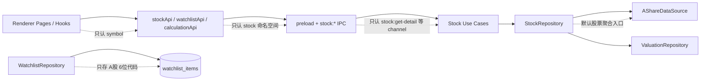
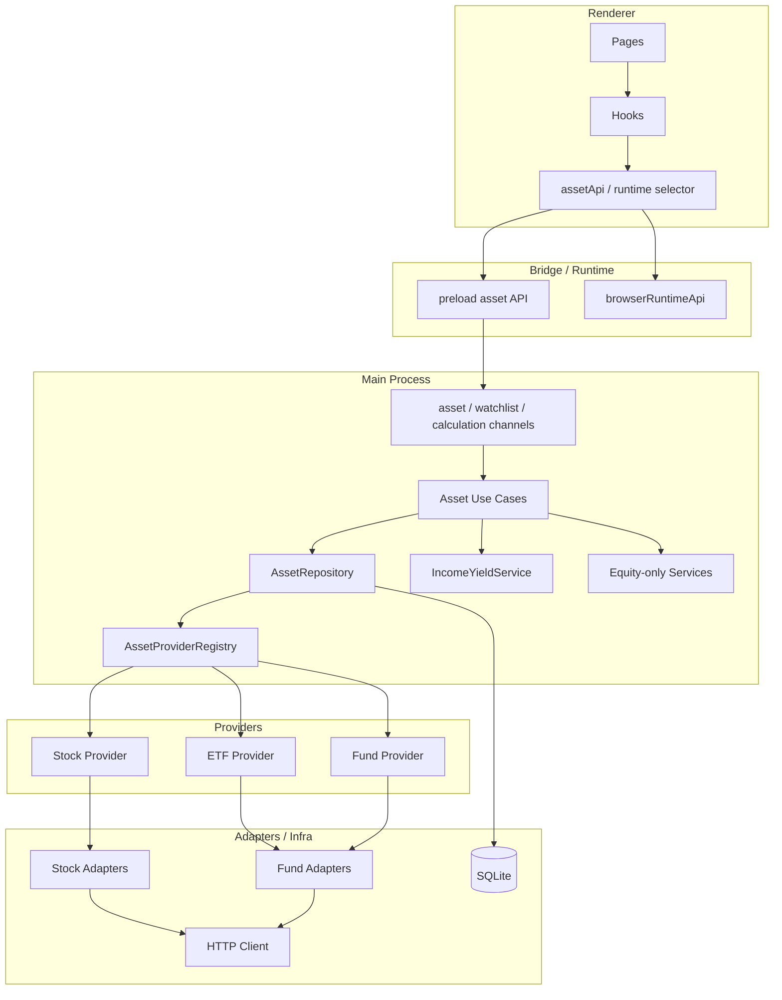
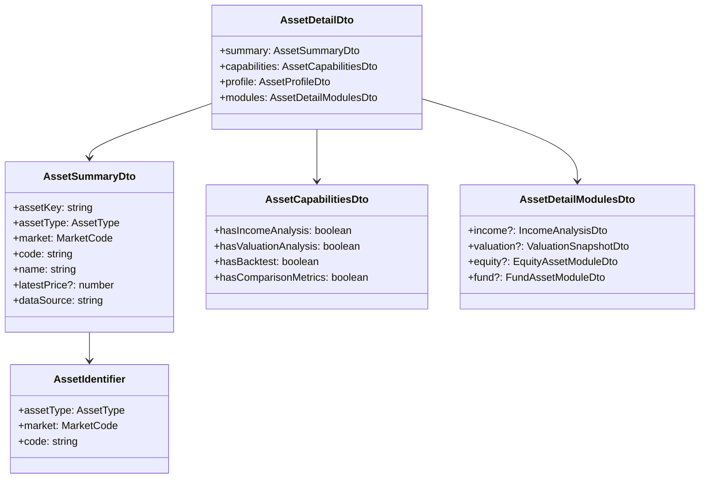
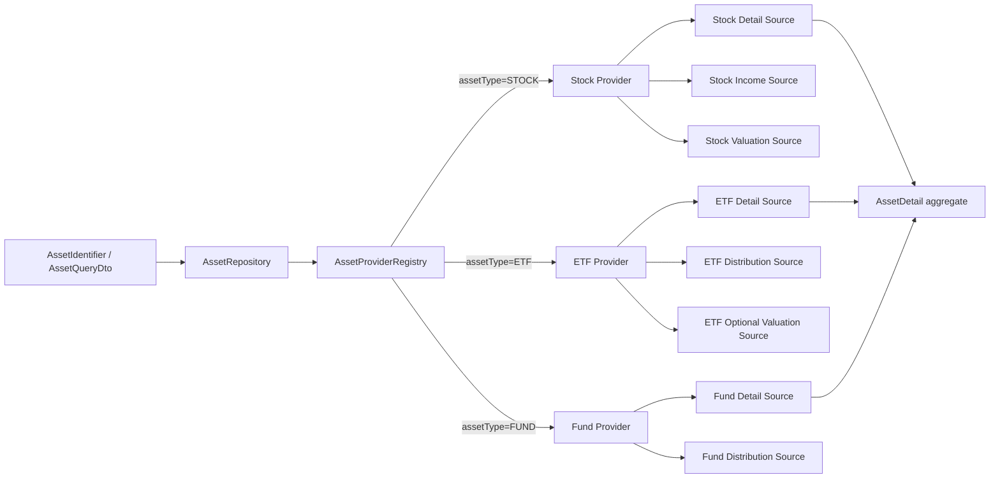
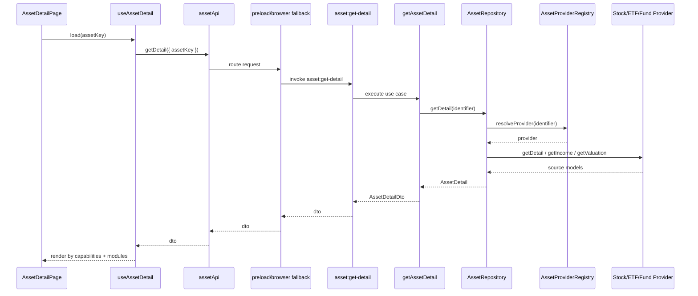
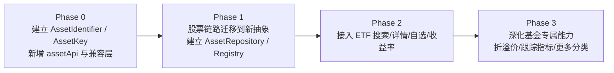

# 多资产扩展架构设计

## 1. 文档目标

本文档用于指导当前以 A 股股票为中心的 DividendMonitor，演进为可同时支持：

1. 股票
2. ETF
3. 其他基金资产（LOF、场内基金、后续可扩展到 REITs/债券基金）

的多资产分析框架。

本文档关注三件事：

1. 先把“股票唯一模型”改造成“资产模型 + 能力模型”
2. 再定义跨层接口如何从 `stock` 演进到 `asset`
3. 最后给出可以逐步落地、不一次性推翻现有代码的实施计划

本文档是后续开发的工作文档，设计目标优先级如下：

1. 抽象分离
2. 可扩展性
3. 可维护性
4. 单一职责
5. 对现有股票功能的兼容迁移

## 2. 当前实现现状

当前代码已具备较清晰的运行时分层：

```text
renderer service -> preload / browser fallback -> ipc -> use case -> repository -> adapter -> infra
```

但“业务对象”仍然是典型的单资产实现，主要问题如下。

### 2.0 现状耦合示意图



### 2.1 当前耦合点

1. 领域实体 `Stock` 直接承载全部资产含义，`market` 固定为 `A_SHARE`
2. `shared/contracts/api.ts` 的顶层 API 为 `stock / watchlist / calculation`，DTO 也都是 `StockDetailDto`、`WatchlistItemDto`
3. `WatchlistRepository` 只存 `symbol`，并且强校验 `A 股 6 位代码`
4. `StockRepository` 同时负责搜索、详情、对比、估值聚合，职责已经接近“单资产聚合入口”
5. `AShareDataSource` 以“股票详情”作为唯一返回结构，无法表达 ETF/Fund 的不同字段和能力
6. `useStockDetail`、`routeContext`、页面路由和浏览器 fallback 全部围绕 `symbol` 工作
7. 计算用例默认假设“资产一定有股票分红、一定适用股票估值口径、一定适合股票复投回测”

### 2.2 结论

当前系统的问题不是“还没接 ETF 数据源”，而是：

```text
资产身份、资产能力、资产专属算法、跨层接口命名
目前都绑定在 stock 语义之下
```

如果直接在现有 `StockRepository`、`StockDetailDto` 上继续叠加 ETF 字段，会出现：

1. DTO 不断膨胀
2. 大量可选字段语义不清
3. 股票计算逻辑污染基金逻辑
4. 页面条件分支快速增长
5. 后续再加 REITs 或债券基金时重复返工

因此必须先做一层“多资产基础抽象”。

## 3. 设计原则

### 3.1 总体原则

1. 用“资产”替代“股票”作为顶层对象
2. 用“能力”替代“类型分支”作为服务选择依据
3. 资产身份与资产详情分离
4. 通用数据与资产专属数据分离
5. 计算模块按能力拆分，不强行做所有资产共用的一套公式
6. 先兼容旧接口，再逐步迁移调用方

### 3.2 能力优先原则

不是所有资产都具备同样的数据能力：

1. 股票通常具备行情、分红、估值、回测
2. ETF 可能具备行情、分配记录、部分估值指标，但不一定有股票式 PE/PB
3. 部分基金只有净值、分红送配和规模数据

因此系统应先判断“该资产有什么能力”，再决定：

1. 页面展示什么模块
2. 可以调用哪些计算
3. 需要走哪个 repository / adapter

而不是到处写：

```text
if (assetType === 'ETF') ...
else if (assetType === 'STOCK') ...
```

## 4. 目标架构

### 4.1 顶层模型

建议把当前“股票中心架构”演进为：

```text
Asset Identity
  -> Asset Catalog / Search
  -> Asset Profile / Quote
  -> Asset Capability Providers
      -> Income / Dividend
      -> Valuation
      -> Backtest
      -> Comparison Metrics
```

### 4.1.1 总体架构图



### 4.2 分层职责

#### Domain

负责：

1. 资产身份模型
2. 资产能力声明
3. 收益分配事件、行情快照等核心实体
4. 各类计算服务的输入约束

不负责：

1. 第三方接口字段
2. IPC
3. 页面展示

#### Repository

负责：

1. 根据资产类型和能力选择正确的数据源
2. 聚合通用信息与资产专属信息
3. 给 use case 返回统一领域对象

不负责：

1. 具体算法决策
2. 页面 ViewModel

#### Adapter

负责：

1. 第三方数据抓取
2. 脏字段清洗与映射
3. 将不同源转换成统一 source model

不负责：

1. 自选业务
2. UI 兜底文案
3. 领域计算

#### Application / Use Case

负责：

1. 按用户动作编排 repository 和 domain service
2. 输出 DTO
3. 在能力不足时返回可解释结果

#### Renderer

负责：

1. 根据资产能力按需展示模块
2. 使用统一 `assetApi`
3. 逐步淘汰只认 `stock symbol` 的页面状态组织

## 5. 核心抽象设计

### 5.1 资产身份

第一步必须把“symbol 字符串”升级为“资产身份对象”。

建议新增：

```ts
export type AssetType = 'STOCK' | 'ETF' | 'FUND'

export type MarketCode = 'A_SHARE'

export type AssetIdentifier = {
  assetType: AssetType
  market: MarketCode
  code: string
}
```

说明：

1. `code` 替代现有到处散落的 `symbol`
2. `assetType` 是一级分类，决定能力装配
3. `market` 先保留 `A_SHARE`，未来再扩展港股、美股

进一步建议新增稳定主键：

```ts
export type AssetKey = string
// 例：STOCK:A_SHARE:600519
//     ETF:A_SHARE:510300
```

`AssetKey` 的作用：

1. 作为 watchlist、routeContext、recent history 的持久化键
2. 避免后续同代码跨市场冲突
3. 避免路由和 IPC 继续只靠裸 `symbol`

### 5.2 资产摘要与详情分离

建议把当前 `StockDetailDto` 拆成三层：

```ts
export type AssetSummaryDto = {
  assetKey: string
  assetType: AssetType
  market: MarketCode
  code: string
  name: string
  latestPrice?: number
  currency?: string
  dataSource: string
}

export type AssetCapabilitiesDto = {
  hasIncomeAnalysis: boolean
  hasValuationAnalysis: boolean
  hasBacktest: boolean
  hasComparisonMetrics: boolean
}

export type AssetDetailDto = {
  summary: AssetSummaryDto
  capabilities: AssetCapabilitiesDto
  profile: AssetProfileDto
  modules: AssetDetailModulesDto
}
```

其中：

1. `summary` 是所有资产都尽量具备的通用字段
2. `capabilities` 决定前端展示和后端可调用功能
3. `profile` 放行业、基金类型、跟踪标的、管理人等静态信息
4. `modules` 放资产专属明细数据

### 5.3 通用模块与专属模块

不要把 ETF/Fund 额外字段塞回 `StockDetailDto`，建议改为模块化 detail：

```ts
export type AssetDetailModulesDto = {
  income?: IncomeAnalysisDto
  valuation?: ValuationSnapshotDto
  equity?: EquityAssetModuleDto
  fund?: FundAssetModuleDto
}
```

示例：

1. 股票详情可返回 `equity + income + valuation`
2. ETF 详情可返回 `fund + income + valuation?`
3. 普通基金可返回 `fund + income?`

这样页面只按模块渲染，不依赖巨大的类型分支。

### 5.4 能力接口

建议在 main/domain 与 repository 层引入能力接口，而不是继续按 `StockRepository` 承载所有逻辑。

```ts
export interface AssetCatalogRepository {
  search(keyword: string, filters?: AssetSearchFilter): Promise<AssetSummary[]>
  getSummary(identifier: AssetIdentifier): Promise<AssetSummary>
}

export interface AssetDetailRepository {
  getDetail(identifier: AssetIdentifier): Promise<AssetDetail>
}

export interface IncomeAnalysisRepository {
  getIncomeAnalysis(identifier: AssetIdentifier): Promise<IncomeAnalysisSource>
}

export interface ValuationRepository {
  getValuation(identifier: AssetIdentifier): Promise<AssetValuationSource | undefined>
}

export interface BacktestRepository {
  getBacktestSource(identifier: AssetIdentifier): Promise<BacktestSource>
}
```

说明：

1. `AssetDetailRepository` 负责返回可供详情页使用的聚合对象
2. `IncomeAnalysisRepository` 只处理“有现金分配能力的资产”
3. `BacktestRepository` 只对“有价格历史且允许回测的资产”开放
4. 某些资产不实现某能力时，返回显式的 unsupported，而不是空字段硬糊过去

### 5.5 资产详情模型关系图



## 6. 领域模型演进

### 6.1 从 `Stock` 改为 `AssetSummary`

当前 `Stock` 实体混合了：

1. 身份
2. 行情
3. 股票专属估值字段

建议拆开：

```ts
export type AssetSummary = {
  identifier: AssetIdentifier
  name: string
  latestPrice?: number
  currency?: string
}

export type EquityMetrics = {
  marketCap?: number
  peRatio?: number
  pbRatio?: number
  totalShares?: number
}

export type FundMetrics = {
  netAssetValue?: number
  discountPremiumRate?: number
  fundSize?: number
  trackingIndex?: string
}
```

### 6.2 从 `DividendEvent` 改为 `IncomeDistributionEvent`

股票和 ETF 都可能有现金分配，但口径不一定完全一样。

建议把领域事件抽象为：

```ts
export type IncomeDistributionEvent = {
  assetKey: string
  eventType: 'DIVIDEND' | 'DISTRIBUTION'
  year: number
  fiscalYear?: number
  announceDate?: string
  recordDate?: string
  exDate?: string
  payDate?: string
  cashPerUnit: number
  totalCashAmount?: number
  referenceClosePrice?: number
  source: string
}
```

这样：

1. 股票分红映射成 `DIVIDEND`
2. ETF 分配映射成 `DISTRIBUTION`
3. 计算层统一用“单位现金分配”处理历史收益率

### 6.3 计算服务拆分

现有计算默认都是股票口径，后续应拆为两类：

#### 通用计算

适用于“有现金分配 + 有价格历史”的资产：

1. 历史现金收益率
2. 区间平均收益率
3. 分配事件时间轴
4. 基于事件复投的回测骨架

#### 股票专属计算

只适用于股票：

1. 基于利润和派息率的未来股息率估算
2. 基于总股本和净利润的派息推演
3. PE / PB 分位估值解释

#### ETF / 基金专属计算

后续新增：

1. 基于近 12 个月分配记录的滚动分配率
2. 基于基金净值或二级市场价格的分配率
3. 折溢价、跟踪误差、规模变化等指标

结论：

```text
“历史现金收益率”可以抽象
“未来股息率估算”不能强行抽象为所有资产共用
```

## 7. 数据源与仓储设计

### 7.1 Adapter 层改造方向

当前只有：

1. `AShareDataSource`
2. `ValuationDataSource`

建议演进为：

```text
src/main/adapters/
  contracts.ts
  registry.ts
  eastmoney/
    stock/
      eastmoneyStockCatalogAdapter.ts
      eastmoneyStockDetailAdapter.ts
      eastmoneyStockIncomeAdapter.ts
      eastmoneyStockValuationAdapter.ts
    fund/
      eastmoneyFundCatalogAdapter.ts
      eastmoneyEtfDetailAdapter.ts
      eastmoneyFundIncomeAdapter.ts
```

注意：

1. 这里不是要求一次性拆这么细
2. 首批可以先保留 `eastmoney/stock/*` 与 `eastmoney/fund/*` 两组
3. 重点是把“股票接入”和“基金接入”隔离开

### 7.2 Repository 层改造方向

当前 `StockRepository` 负责太多事，建议拆成：

```text
AssetCatalogRepository
AssetDetailRepository
AssetIncomeRepository
AssetComparisonRepository
WatchlistRepository
```

如果想保持当前目录深度，也可以先采用“外层聚合 + 内层子仓储”：

```text
AssetRepository
  - stockProvider
  - etfProvider
  - fundProvider
  - valuationRepository
```

但要满足两个约束：

1. `AssetRepository` 只做路由和聚合，不做每种资产的具体抓取
2. 资产专属逻辑必须留在 provider / sub-repository 里

### 7.3 Provider / Registry 机制

建议新增资产提供者注册表：

```ts
export interface AssetProvider {
  supports(identifier: AssetIdentifier): boolean
  search?(keyword: string): Promise<AssetSummary[]>
  getDetail(identifier: AssetIdentifier): Promise<AssetDetailSource>
  getIncomeAnalysis?(identifier: AssetIdentifier): Promise<IncomeAnalysisSource>
  getValuation?(identifier: AssetIdentifier): Promise<AssetValuationSource | undefined>
}
```

然后由注册表分发：

```ts
class AssetProviderRegistry {
  getProvider(identifier: AssetIdentifier): AssetProvider
  searchAll(keyword: string, filters?: AssetSearchFilter): Promise<AssetSummary[]>
}
```

这样后续接入：

1. 股票 provider
2. ETF provider
3. 普通基金 provider

都不需要改动上层 use case 的主流程。

### 7.4 Provider 分发关系图



## 8. 接口与契约演进

### 8.1 共享契约改造原则

`shared/contracts/api.ts` 建议从 `stock` 语义改成 `asset` 语义。

目标接口：

```ts
interface DividendMonitorApi {
  asset: {
    search(request: AssetSearchRequestDto): Promise<AssetSearchItemDto[]>
    getDetail(request: AssetQueryDto): Promise<AssetDetailDto>
    compare(request: AssetCompareRequestDto): Promise<AssetComparisonRowDto[]>
  }
  watchlist: {
    list(): Promise<WatchlistEntryDto[]>
    add(request: WatchlistAddRequestDto): Promise<void>
    remove(assetKey: string): Promise<void>
  }
  calculation: {
    getHistoricalIncomeYield(request: AssetQueryDto): Promise<HistoricalIncomeYieldResponseDto>
    estimateForwardIncomeYield(request: AssetQueryDto): Promise<ForwardIncomeYieldResponseDto>
    runIncomeReinvestmentBacktest(request: BacktestRequestDto): Promise<BacktestResultDto>
  }
}
```

### 8.2 请求对象化

当前大量接口都是：

```ts
getDetail(symbol: string)
```

建议逐步升级为：

```ts
type AssetQueryDto = {
  assetKey?: string
  assetType?: AssetType
  market?: MarketCode
  code?: string
}
```

原因：

1. 为兼容 `assetKey` 和旧路由参数
2. 为未来 Web/API 接口保留扩展位
3. 避免后续每新增一个筛选维度都要改函数签名

### 8.3 兼容迁移策略

不建议一次性删除现有 `stock.*` 接口，建议采用双轨：

#### Phase A

1. 新增 `asset.*`
2. `stock.*` 内部代理到 `asset.*`
3. DTO 暂时保留兼容字段

#### Phase B

1. 前端页面全部切到 `assetApi`
2. preload / browser fallback 切到 `asset.*`
3. 文档改为 `asset` 主接口

#### Phase C

1. 移除或只保留极薄兼容层 `stock.*`

### 8.4 资产详情请求交互时序图



## 9. Watchlist 与路由设计

### 9.1 Watchlist 数据模型

当前 `watchlist_items` 只保存 `symbol`，必须升级。

建议结构：

```text
watchlist_items
  asset_key      TEXT UNIQUE
  asset_type     TEXT
  market         TEXT
  code           TEXT
  name           TEXT
  created_at     TEXT
  updated_at     TEXT
```

说明：

1. `asset_key` 作为唯一主键
2. `asset_type + market + code` 作为冗余字段，便于查询和排查
3. `name` 可做冗余缓存，避免列表首次加载全部回源才有名称

### 9.2 路由上下文

当前 `routeContext.ts` 只记 `symbol`，建议改成：

1. `LAST_ASSET_KEY`
2. `RECENT_ASSET_KEYS`
3. `LAST_COMPARISON_ASSET_KEYS`
4. `LAST_WATCHLIST_SELECTIONS`

路由建议逐步演进为：

```text
/asset-detail?assetKey=STOCK:A_SHARE:600519
/comparison?assetKeys=STOCK:A_SHARE:600519,ETF:A_SHARE:510300
/backtest?assetKey=ETF:A_SHARE:510300
```

这样既兼容现有 query 方式，也避免路径参数编码复杂化。

## 10. 页面与前端实现策略

### 10.1 页面层

不要直接复制出一个 `EtfDetailPage` 与 `FundDetailPage`。

建议保留：

1. `AssetDetailPage`
2. `ComparisonPage`
3. `WatchlistPage`
4. `BacktestPage`

由页面内部根据 `capabilities` 和 `modules` 控制渲染。

### 10.2 组件层

组件拆分为：

#### 通用组件

1. `AssetHeaderCard`
2. `IncomeHistoryChart`
3. `IncomeDistributionTable`
4. `BacktestSummaryCard`

#### 股票专属组件

1. `EquityValuationCard`
2. `FutureDividendEstimateCard`

#### ETF / 基金专属组件

1. `FundProfileCard`
2. `TrackingIndexCard`
3. `DistributionRateCard`
4. `DiscountPremiumCard`

### 10.3 Browser Fallback

浏览器 fallback 也必须跟着抽象，不然后端抽象完，前端预览会继续被旧接口卡住。

建议把当前 `mockStockDetails` 改为：

```ts
const mockAssetDetails: Record<string, AssetDetailDto>
```

至少内置：

1. 一只股票
2. 一只 ETF
3. 一只普通基金或预留 ETF 第二样本

这样前端在不启动 Electron 的情况下，也能验证多资产页面结构。

## 11. 具体代码落点建议

### 11.1 第一批必须改动的文件

#### shared

1. `shared/contracts/api.ts`

#### main

1. `src/main/domain/entities/Stock.ts` -> 拆为 `asset.ts`、`income.ts` 等
2. `src/main/adapters/contracts.ts`
3. `src/main/adapters/index.ts`
4. `src/main/repositories/stockRepository.ts`
5. `src/main/repositories/watchlistRepository.ts`
6. `src/main/application/useCases/*`
7. `src/main/ipc/channels/stockChannels.ts`
8. `src/main/ipc/channels/watchlistChannels.ts`
9. `src/main/ipc/channels/calculationChannels.ts`
10. `src/preload/index.ts`

#### renderer

1. `src/renderer/src/services/desktopApi.ts`
2. `src/renderer/src/services/browserRuntimeApi.ts`
3. `src/renderer/src/services/stockApi.ts`
4. `src/renderer/src/services/watchlistApi.ts`
5. `src/renderer/src/services/calculationApi.ts`
6. `src/renderer/src/services/routeContext.ts`
7. `src/renderer/src/hooks/useStockDetail.ts`
8. `src/renderer/src/hooks/useWatchlist.ts`
9. `src/renderer/src/pages/StockDetailPage.tsx`
10. `src/renderer/src/router/AppRouter.tsx`

### 11.2 推荐新增文件

```text
src/main/domain/entities/asset.ts
src/main/domain/entities/income.ts
src/main/domain/services/incomeYieldService.ts
src/main/repositories/assetRepository.ts
src/main/repositories/assetProviderRegistry.ts
src/main/application/useCases/searchAssets.ts
src/main/application/useCases/getAssetDetail.ts
src/main/application/useCases/compareAssets.ts
src/renderer/src/services/assetApi.ts
src/renderer/src/hooks/useAssetDetail.ts
```

说明：

1. 首期不一定要把所有旧文件立刻删除
2. 但新的抽象入口必须先建立，避免继续在旧命名上堆功能

## 12. 分阶段实施计划

### 12.0 迁移路线图



### Phase 0：定义抽象，不接新数据源

目标：

1. 建立 `AssetIdentifier / AssetKey / AssetType`
2. 新增 `assetApi` 与 `asset.*` IPC 契约
3. 把 watchlist、routeContext、browser fallback 升级到 `assetKey`
4. 保持当前股票功能可用

交付物：

1. 新版 shared contracts
2. 兼容层 `stock.* -> asset.*`
3. 数据库迁移脚本或 SQLite schema 升级方案
4. 前端可通过 `assetKey` 打开股票详情

验收标准：

1. 现有股票搜索、自选、详情、对比、回测全部仍可运行
2. 代码中不再新增新的“只认 A 股 symbol”的公共接口

### Phase 1：仓储与领域通用化

目标：

1. 建立 `AssetRepository` / `AssetProviderRegistry`
2. 把股票链路接到新的资产抽象下
3. 抽离通用 `IncomeDistributionEvent` 和历史收益率计算

交付物：

1. 股票 provider
2. 通用历史收益率服务
3. `AssetDetailDto` 与模块化 detail 结构

验收标准：

1. 股票详情页通过 `AssetDetailDto` 渲染
2. `StockRepository` 不再是唯一正式入口，最多只剩兼容壳

### Phase 2：接入 ETF 资产

目标：

1. 接入 ETF 搜索与详情
2. 支持 ETF 自选、详情、对比
3. 支持 ETF 历史分配收益率

首批能力建议：

1. 搜索
2. 基础资料
3. 最新价 / 净值 / 规模等可得指标
4. 分配记录
5. 历史收益率

暂缓能力：

1. 股票式未来股息率估算
2. 强依赖 PE/PB 的估值解释

验收标准：

1. ETF 可被搜索并加入自选
2. ETF 详情页可正常展示通用模块和基金专属模块
3. 股票专属卡片不会错误显示在 ETF 页面

### Phase 3：基金能力深化

目标：

1. 引入基金专属估值/折溢价/跟踪指标
2. 扩展 ETF / LOF / 普通基金更多分类
3. 评估是否支持基金分配复投回测

交付物：

1. 基金专属分析模块
2. 更细粒度的能力矩阵
3. 文档和手动验证指南补充

## 13. 风险与注意事项

### 13.1 最大风险

最大风险不是技术接入，而是抽象失衡：

1. 过度通用，导致类型过于复杂
2. 通用不够，导致 ETF 仍然塞进股票模型

建议判断标准：

1. 能被两个以上资产类型复用的，进入通用层
2. 明显依赖股票财务口径的，留在股票专属层
3. 页面按模块渲染，不按巨型类型判断

### 13.2 命名约束

从现在开始建议遵守：

1. 顶层统一使用 `asset`
2. 股票专属逻辑明确命名为 `equity` 或 `stock`
3. 基金专属逻辑明确命名为 `fund` 或 `etf`
4. 公共层禁止再出现“默认一定是股票”的泛型命名

## 14. 推荐实施顺序

建议按以下顺序推进，而不是直接去写 ETF adapter：

1. 先改 shared contracts 和 route/watchlist 主键模型
2. 再改 main 的 repository/provider 抽象
3. 再让股票链路跑在新抽象上
4. 最后接 ETF 数据源
5. ETF 跑通后再补基金专属分析模块

这样做的原因是：

```text
先把轨道修好，再让第二类资产上车
否则 ETF 一接进来，旧的 stock 语义会在所有层面继续扩散
```

## 15. 本次设计的直接结论

本项目新增 ETF/基金资产时，推荐采用以下主方案：

1. 顶层从 `stock` 升级为 `asset`
2. 用 `AssetIdentifier + AssetKey` 替代裸 `symbol`
3. 用 `capabilities + detail modules` 替代单一 `StockDetailDto`
4. 用 provider/registry 机制承接不同资产数据源
5. 把历史收益率抽成通用能力，把未来股息率估算保留为股票专属能力
6. 用双轨兼容方式迁移现有股票接口，避免一次性大破坏

如果按这个方案执行，后续再加：

1. REITs
2. 债券 ETF
3. LOF
4. 港股高股息资产

都可以沿用同一套演进路径，而不需要再次重构顶层结构。

## 16. 实施状态（2026-04-27）

### 已完成

| 设计项 | 对应设计节 | 实现文件 |
|--------|-----------|---------|
| AssetIdentifier / AssetKey | §5.1 | `shared/contracts/api.ts` |
| AssetCapabilitiesDto | §5.2 | `shared/contracts/api.ts:273-278` |
| AssetDetailModulesDto (income/valuation/equity/fund) | §5.3 | `shared/contracts/api.ts:305-310` |
| AssetProvider 接口 + getCapabilities() | §5.4 / §7.3 | `src/main/repositories/assetProviderRegistry.ts:33-40` |
| AssetProviderRegistry | §7.3 | `src/main/repositories/assetProviderRegistry.ts:227-248` |
| StockAssetProvider | §7.3 | `src/main/repositories/assetProviderRegistry.ts:77-145` |
| EtfAssetProvider | §7.3 | `src/main/repositories/assetProviderRegistry.ts:147-185` |
| FundAssetProvider | §7.3 | `src/main/repositories/assetProviderRegistry.ts:187-225` |
| EastmoneyFundDetailDataSource | §7.1 | `src/main/adapters/eastmoney/eastmoneyFundDetailDataSource.ts` |
| EastmoneyFundCatalogAdapter | §7.1 | `src/main/adapters/eastmoney/eastmoneyFundCatalogAdapter.ts` |
| 前端能力驱动渲染 | §10.1 | `src/renderer/src/pages/StockDetailPage.tsx` |
| ETF/基金未来分配率估算 | §6.3 基金专属 | `src/main/domain/services/futureYieldEstimator.ts` (`estimateFundFutureYield`) |
| asset:* IPC 通道 | §8.1 | `src/main/ipc/channels/assetChannels.ts` |

### 与设计文档的差异

1. **§5.2 AssetSummaryDto**：实际实现中未独立出 `AssetSummaryDto`，基础字段直接在 `AssetDetailDto` 顶层平铺，与 `modules` 并列。前端按 `capabilities` + `modules` 渲染，工作良好。
2. **§5.4 独立能力接口**：设计建议拆成 `AssetCatalogRepository` / `IncomeAnalysisRepository` 等独立接口，实际采用聚合的 `AssetProvider` 接口（含 `supports` / `search` / `getDetail` / `compare` / `getCapabilities`），通过 `AssetProviderRegistry` 路由。
3. **ETF 能力声明**：ETF 和 FUND 当前使用相同的能力矩阵 (`ETF_FUND_CAPABILITIES`)，后续可拆细（如部分 ETF 可能有估值数据）。
4. **基金未来收益率估算**：`estimateFundFutureYield()` 基于历史分配记录，使用最近 1-3 年数据（而非原设计 §6.3 提到的"近 12 个月滚动分配率"）。两者概念相近，当前实现更简洁。
